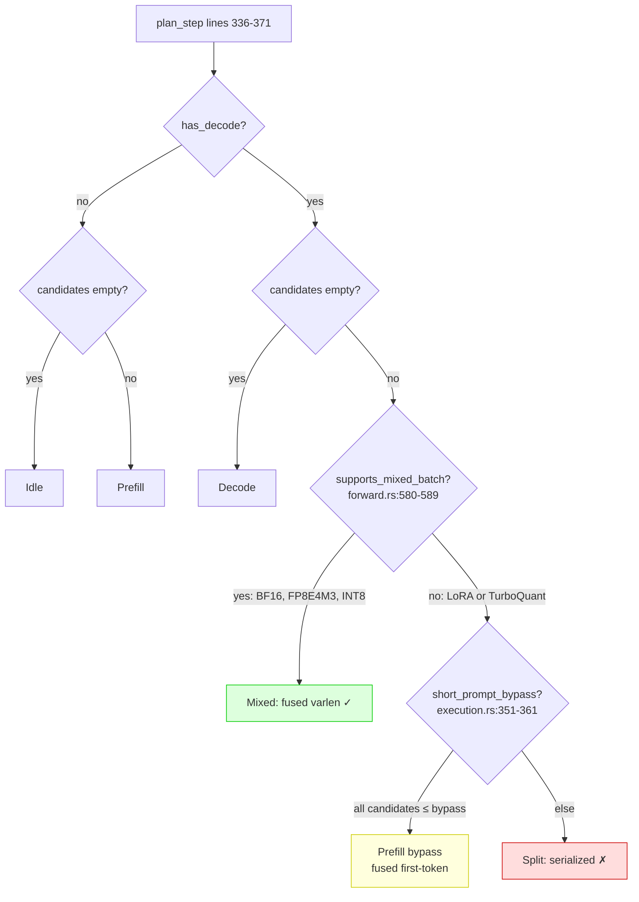
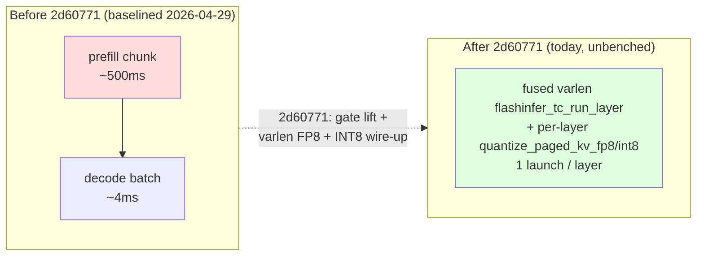
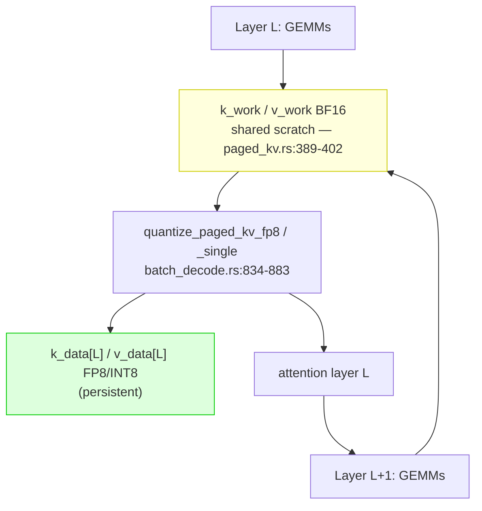
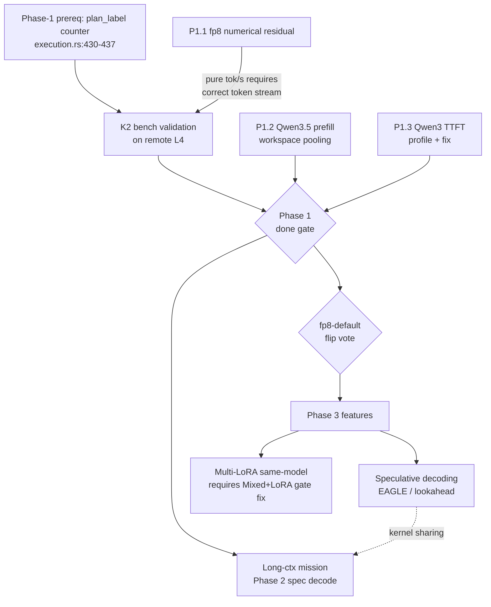
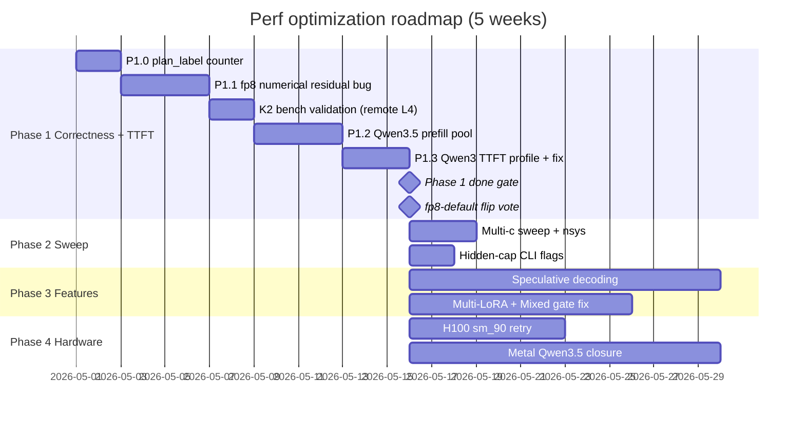

# Performance Optimization Plan & Acceptance — 2026-05-01

> **Status:** Draft v2 — multi-agent review integrated 2026-05-01
> **Owner:** ckl
> **Anchors:** post-fp8KV baseline `docs/projects/2026-04-30-roadmap-after-fp8kv-baseline.md`,
> throughput-gap analysis `docs/projects/2026-04-29-throughput-gap-analysis.md`,
> scheduler pipeline map `docs/projects/2026-04-29-scheduler-pipeline-map.md`,
> longctx mission `docs/projects/2026-04-30-longctx-32k-128k-leadership.md`.
> **Bench discipline:** every in-scope code change lands a `wins/` entry (or
> `pending-remote` stub) per `docs/bench-and-trace-spec.md` §1, §5, §7, §10.

---

## 1 · Mission

Close the SGLang gap on TTFT and fp8 numerics, validate the levers we
already shipped (K2 Mixed-quantized wire-up at `2d60771`), then stack
speculative decoding + multi-LoRA on top. Target: `ARLE.tok/s ≥ 1.30 ×
max(SGLang, vLLM, TRT-LLM)` on the canonical `c=16/4096/256/120s` shape
on L4 and H100, plus the Phase-1 foundation for the long-context
world-#1 mission (`docs/projects/2026-04-30-longctx-32k-128k-leadership.md`).

**Hypothesis** (per spec §1 / §7 principle #1):

> P1.1 + K2 bench-validation + P1.2 + P1.3 together close the four ARLE
> TTFT rows to within +15% of SGLang and lift fp8 common-token match
> ≥ 70%, without regressing decode-side ITL leadership.

**Non-goals (this plan):**

- Multi-node serving — see `docs/plans/2026-05-01-multi-gpu-cluster-architecture.md`.
- Multimodal — see `docs/plans/2026-05-01-multimodal-vision-cuda-metal.md`.
- Train/RL surface — see `docs/plans/rust-agent-rl-single-node.md`.

---

## 2 · Current baseline (CUDA L4, fp8 KV, c=16/4096/256/120s)

Source: `docs/experience/wins/2026-04-29-bench-guidellm-cuda-l4-headline-summary.md`,
`docs/experience/wins/2026-04-29-bench-guidellm-cuda-l4-fp8kv-ablation.md`.

| Dimension              | ARLE     | SGLang  | Verdict                  |
|------------------------|---------:|--------:|--------------------------|
| ITL Qwen3 fp8          | 72.55 ms | 86.20 ms | **ARLE leads −16%** ✓   |
| ITL Qwen3.5 fp8        | 57.14 ms | 70.40 ms | **ARLE leads −19%** ✓   |
| TTFT Qwen3 fp8         | 13.24 s  |  8.38 s | ARLE +58% slower ✗      |
| TTFT Qwen3.5 fp8       | 13.27 s  |  6.57 s | ARLE +102% slower ✗     |
| fp8 KV numerical match | 39.08%   | 77.54% | ARLE residual bug ✗     |

Decode kernel path is genuinely faster. The gap is **prefill performance + fp8 numerics**.

> **Important truth correction (2026-05-01).** The Mixed-quantized
> wire-up tracked as "K2 pending" in earlier docs **already landed at
> commit `2d60771` on 2026-04-30 18:08 CST**. The 2026-04-29 baseline
> above predates the wire-up. K2's outstanding work is **bench
> validation on remote L4** (the pending-remote stub
> `docs/experience/wins/2026-04-30-bench-guidellm-longctx-32k-phase1-s1-s2-pending-remote.md`)
> plus the `plan_label` observability counter so post-K2 distribution
> is verifiable without log grepping.

---

## 3 · Architecture: where the time goes

### 3.1 Scheduler decision tree (today, post-`2d60771`)

`infer/src/scheduler/cuda/execution.rs::plan_step` (lines 336-371) has
**four** arms when both decode rows and prefill candidates are present.



Today's gate body (`infer/src/model/qwen3/forward.rs:580-589`,
last touched by `2d60771`):

```rust
fn supports_mixed_batch(&self, kv_pool_format: KVFormat) -> bool {
    self.prefill_uses_paged_pool()
        && self.lora.is_none()
        && matches!(
            kv_pool_format,
            KVFormat::BF16 | KVFormat::FP8E4M3 | KVFormat::INT8,
        )
}
```

Mirror gate at `infer/src/model/qwen3/batch_decode.rs:546-554`:

```rust
if self.lora.is_some() { return Ok(false); }
let kv_format = paged_kv_pool.format;
if !matches!(kv_format,
        KVFormat::BF16 | KVFormat::FP8E4M3 | KVFormat::INT8) {
    return Ok(false);
}
```

### 3.2 What K2 actually changed



Per-layer ordering inside `decode_batch_with_prefill` (paths in
`infer/src/model/qwen3/batch_decode.rs`):

1. Q/K/V GEMMs.
2. `decode_prep_paged_cuda` writes BF16 K/V into `k_work` / `v_work`
   for decode rows.
3. `prefill_attention_paged_prep_cuda` writes BF16 K/V for each prefill
   row.
4. **For FP8E4M3:** `kv_quant::quantize_paged_kv_fp8` packs `k_work` /
   `v_work` into `k_data[layer]` / `v_data[layer]` (lines 829-855).
5. **For INT8:** `kv_quant::quantize_paged_kv_single` (lines 857-883).
6. One fused `flashinfer_tc_run_layer` (BF16) or
   `decode_attention_varlen_fp8` / `_int8` (quantized) over all rows.

> **Load-bearing invariant (do not reorder without re-bench):** the
> per-layer order MUST be **prep → quantize → attention** within layer
> L, with no overlap into layer L+1's prep. `paged_kv_pool.k_work` is
> a single layer's scratch shared across all 36 layers
> (`crates/cuda-kernels/src/paged_kv.rs:389-402`); any future
> async-overlap optimization that defers layer-L attention past
> layer-L+1's prep silently corrupts FP8/INT8 attention output. Cite
> this invariant in any PR touching the mixed path.

### 3.3 KV pool buffer flow



This shape is why the BF16-shadow approach was rejected (see
`docs/experience/errors/2026-04-29-bf16-shadow-mixed-architectural-dead-end.md`):
the BF16 view of layer L is overwritten the moment layer L+1's
`decode_prep` runs.

### 3.4 Phase dependency DAG



---

## 4 · Optimization levers (ranked by tok/s impact)

Numbering reuses K1-K9 from `docs/projects/2026-04-29-perf-bug-roundup.md`
and P1.x from the post-fp8KV roadmap so cross-references stay stable.

### Lever P1.1 — fp8 KV residual numerical bug (CORRECTNESS GATE; LANDS FIRST)

**Why first:** K2 is wired but its tok/s numbers are computed on token
streams that diverge from reference at generated token 1 (39.08% match
vs SGLang 77.54%). Wrong-token streams change stop-token timing and
prefix-cache hit profile, contaminating any K2 bench run. **P1.1 must
close before K2 bench is published.**

**Symptom (anchor):**
`docs/experience/wins/2026-04-29-bench-guidellm-cuda-l4-fp8kv-ablation.md` —
3/16 exact prompts, 39.08% common-token match, divergence at generated
token 1.

**Candidates:** RoPE order vs quantize, scale dtype/shape, FlashInfer
fp8 reduce ordering.

**Method:**
```bash
# Reference dump from SGLang reference
scripts/dump_sglang_kv.sh --model Qwen/Qwen3-4B \
    --kv-dtype fp8 --prompts test_data/fp8_repro_5tok.json \
    --out /tmp/sglang_kv_dump.bin
# ARLE side
INFER_DUMP_KV=/tmp/arle_kv_dump.bin \
    cargo test --release -p infer --test e2e_fp8_repro --features cuda
diff <(xxd /tmp/sglang_kv_dump.bin) <(xxd /tmp/arle_kv_dump.bin) | head -200
```

> Eval set + dump scripts are **prerequisites** that may not exist yet.
> If a script above is missing, file it as P1.1.0 and land before P1.1.

**Acceptance:**
- ≥ 70% common-token match on the 16-prompt eval set
  (`infer/test_data/fp8_repro_16prompt.json`).
- Divergence (first non-matching token) at index ≥ 2.
- No regression on canonical headline run: `c=16/4096/256/120s` Qwen3
  fp8 tok/s within ±3% of the canonical-duration baseline in
  `docs/experience/wins/2026-04-29-bench-guidellm-c16fixed-fp8.md`
  (105.22 tok/s ± 3.16). The 145.30 tok/s figure quoted in
  `2026-04-29-bench-guidellm-cuda-l4-kv-quant-matrix.md` is a
  tuned-config (FP8 + chunk=512) variant, not the canonical baseline,
  and must not be used as the no-regression anchor.
- Errors entry `docs/experience/errors/2026-05-XX-arle-fp8kv-residual-bug.md`
  documents root cause and the rule that prevents recurrence.
- Commit subject: `fix(qwen35): close fp8 attention math residual`.

### Lever K2 — Mixed-quantized wire-up bench validation

**Status:** wired at commit `2d60771` (2026-04-30); pending-remote bench
stub at
`docs/experience/wins/2026-04-30-bench-guidellm-longctx-32k-phase1-s1-s2-pending-remote.md`.
Outstanding work is **validation**, not implementation.

**Pending sub-tasks:**
1. Add `plan_label` counter to `/v1/stats` so Mixed/Split/Decode/Prefill
   distribution is visible without log parsing. Today the only surface
   is the conditional log line at
   `infer/src/scheduler/cuda/execution.rs:430-437`. **Phase-1
   prerequisite, not afterthought.**
2. Run `c=16/4096/256/120s` fp8 bench on remote L4 **after P1.1
   closes**.
3. INT8 path validation — `decode_attention_varlen_int8` exists at
   `crates/cuda-kernels/src/kv_quant.rs` (per-row variant) and
   `quantize_paged_kv_single` is wired in `batch_decode.rs:857-883`,
   but no end-to-end correctness gate has run yet.

**Acceptance:**
- `c=16/4096/256/120s` fp8 Qwen3: tok/s **≥ 180** (Δ ≥ +30% vs
  `2026-04-29-bench-guidellm-cuda-l4-headline-summary.md` Qwen3 fp8
  138.17 tok/s); TTFT p50 **≤ 4.0 s** (Δ ≥ −70% vs 13.24 s).
- `c=16/4096/256/120s` fp8 Qwen3.5: tok/s **≥ 175** (Δ ≥ +15% vs same
  baseline Qwen3.5 fp8 151.76 tok/s); TTFT p50 **≤ 5.0 s** (Δ ≥ −62%
  vs 13.27 s).
- `/v1/stats` shows `plan_label.Mixed > 0` and `plan_label.Split = 0`
  on a 60s warm sample of the run.
- e2e gate: `cargo test --release -p infer --test e2e --features cuda`
  passes per spec §10.1.
- INT8 acceptance: tok/s within −5%/+0% of FP8 at same shape; ITL p50
  within +5% of FP8.
- Resolved wins entry `docs/experience/wins/2026-04-30-bench-guidellm-longctx-32k-phase1-s1-s2.md`
  (rename from `-pending-remote`) cites prior baseline with Δ% table
  per spec §10.4.

### Lever P1.2 — Qwen3.5 prefill workspace pooling

**Root cause** (confirmed 2026-04-30): `max_concurrent_prefill_requests=Some(1)`
because the workspace estimator over-provisions for 4-prompt parallel
scratch. 16×4096 prefill takes 32 sequential steps vs SGLang's 4
packed.

**Fix:** time-share the prefill scratch (`GdrChunkwiseScratch` +
FlashInfer HD256 plan + linear-attn recurrent buffers); remove the
cap.

**Reverted dead end:** drain mode (`4d23a12d`, `ed6df900`) — empirically
TTFT-flat. Do **not** revisit.

**Acceptance:**
- `c=16/4096/256/120s` Qwen3.5 fp8 TTFT p50 **≤ 8.0 s** (Δ ≤ −40% vs
  baseline 13.27 s — within +22% of SGLang's 6.57 s).
- `c=16/4096/256/120s` Qwen3.5 fp8 tok/s **≥ 165** (Δ ≥ +9% vs 152).
- `c=1/1024/256/60s` Qwen3.5 fp8 ITL p50 within ±3% of
  `2026-04-29-bench-guidellm-cuda-l4-qwen35-c16-post-step-phase.md`
  (no decode regression).
- Wins entry: `docs/experience/wins/2026-05-XX-prefill-workspace-pooling-qwen35.md`.

### Lever P1.3 — Qwen3 TTFT residual (profile-driven)

Qwen3 has no admission cap yet still TTFT +58% vs SGLang. **Profile
first** — do not patch blind.

**Candidates:** FlashInfer prefill plan recompute per shape, cuBLAS
algo cache miss on first 4096-shape, per-step admission overhead,
autotune coverage gaps.

**Method:**
```bash
# Canonical wrapper per spec §3 (not the resources/ pointer)
scripts/profile_nsys_guidellm.sh qwen3-c16-ttft-profile \
    --target http://localhost:8000 --model Qwen/Qwen3-4B \
    --max-seconds 60
```
The wrapper produces `bench-output/<label>/nsys.qdrep`. Read
`prefill_plan_prep_us` and `layer_forward_us` from the trace summary
(`bench-output/<label>/service_stats_trace_summary.md` —
`prefill_plan_prep_us / layer_forward_us` ratio is the answer).

**Acceptance:**
- `c=16/4096/256/120s` Qwen3 fp8 TTFT p50 **≤ 9.5 s** (Δ ≤ −28% vs
  13.24 s, within +13% of SGLang's 8.38 s).
- Per-step `prefill_plan_prep_us / layer_forward_us` **< 5%** in the
  trace summary, sampled over the last 60 s of run.
- Wins entry cites the `nsys.qdrep` artefact path.

### Lever K1 — bf16 merged-QKV / gate_up fast path (c=1 decode-bound)

After commit `c4109b29` deduplicated 4.7 GB of merged-weight VRAM,
bf16 batched decode does 3 separate q/k/v + 2 separate gate/up GEMM
launches per layer. At `c=16` the larger pool absorbs the launch cost;
at `c=1` it is suspected to show. Merged-weight call sites can be
located via `git log --diff-filter=D -p -- infer/src/model/qwen3/`
intersected with `c4109b29`.

**Fix:** keep only individual q/k/v / gate / up weights; build the
merged form as a per-batch scratch view on first call (no extra eager
VRAM).

**Acceptance:**
- `c=1/1024/256/60s` Qwen3 bf16 ITL p50 within ±3% of pre-`c4109b29`
  baseline (anchor:
  `docs/experience/wins/2026-04-28-bench-guidellm-cuda-l4-weight-dedup.md`
  before-snapshot column).
- `c=16/4096/256/120s` Qwen3 bf16 tok/s no worse than current
  post-`c4109b29` value.
- VRAM: server boot log shows `post_model_load free ≥ 15.0 GB` on L4
  (read from the `free vram after model load` line emitted at server
  start). No VRAM regression.
- Wins entry compares both before/after columns of the dedup entry.

### Lever K9 — INT8 dequant overhead (~17% ITL)

INT8 ITL p50 is 17% higher than FP8 at the same shape (98 ms vs 75 ms,
n=3 medians, anchor:
`docs/experience/wins/2026-04-29-bench-guidellm-cuda-l4-kv-quant-matrix.md`).
INT8 attention reads per-page scale tables; FP8 (E4M3) is
self-describing.

**Fix:** consolidate the per-row INT8 path with the K2 varlen path —
add per-page K/V scale loads to the varlen kernel template. Marginal
new code surface.

**Acceptance:**
- `c=16/4096/256/120s` INT8 ITL p50 within +5% of FP8 ITL p50 at same
  shape.
- `/v1/stats` shows `plan_label.Mixed > 0` on INT8 runs.
- Wins entry cites `2026-04-29-bench-guidellm-cuda-l4-kv-quant-matrix.md`
  98ms / 75ms baseline.

### Cross-cutting invariants & demotion contracts

Stated explicitly so future patches do not silently break them:

- **Mixed + LoRA** — `forward.rs:582` requires `lora.is_none()`; mirror
  gate at `batch_decode.rs:546-548` returns `Ok(false)`. After K2's
  gate lift, multi-LoRA serving silently demotes to Split. **Phase 3
  multi-LoRA is therefore blocked on lifting this gate.** Filed
  separately, not in this plan's scope.
- **Mixed + TurboQuant** — `forward.rs:580-589` does not list
  TurboQuant; any code path reaching the mixed body with TurboQuant
  hits `unreachable!` (e.g.
  `infer/src/model/qwen3/batch_decode.rs:1525-1529`). Not extending
  Mixed to TurboQuant is intentional today; future TurboQuant + Mixed
  work needs a separate kernel and a separate gate row.
- **Per-layer ordering** — see §3.2 invariant box.

---

## 5 · Phase plan & sequencing



### 5.1 Phase 1 done gate (4 conditions)

Each is mechanically testable; `(2)` and `(3)` need the prereq scripts
and counter to land first.

1. **TTFT within +15% of SGLang** on the four ARLE fp8 rows in §2
   (Qwen3 fp8 ITL, Qwen3.5 fp8 ITL, Qwen3 fp8 TTFT, Qwen3.5 fp8 TTFT).
   Computable from the published wins entries; assertable as
   `arle_ttft_p50_ms / sglang_ttft_p50_ms ≤ 1.15` per row. BF16 rows
   are excluded — SGLang BF16 KV is `n/a` in the headline summary, so
   no comparison anchor exists.
2. **fp8 KV common-token match ≥ 70%** on the 16-prompt eval set (eval
   set path landed in P1.1).
3. **`plan_label.Mixed > 0` and `plan_label.Split = 0`** in `/v1/stats`
   on the canonical fp8 c=16 sweep (`plan_label` counter landed in
   P1.0).
4. **Each lever has a `wins/` entry** (or `pending-remote` stub) per
   `CLAUDE.md` §Benchmarks. File-existence check.

### 5.2 fp8-default flip acceptance (separate gate, post-Phase-1)

Phase 1 done is necessary but not sufficient. Flipping fp8 from
opt-in to default requires:

- **Numerical:** common-token match ≥ 75% (Phase 1 minimum 70%) on
  16-prompt eval set; ≥ 70% on a 64-prompt extended eval set if
  available.
- **Throughput non-regression:** `c=16/4096/256/120s` Qwen3 fp8 tok/s
  within +0%/−5% of bf16 KV at the same shape (anchor:
  `docs/experience/wins/2026-04-29-bench-guidellm-cuda-l4-kv-quant-matrix.md`).
- **Same for Qwen3.5.**
- **No new errors entry** opened in the 7 days before flip.
- Decision recorded in `docs/projects/2026-04-30-roadmap-after-fp8kv-baseline.md`
  Decision Log with anchor commit and the bench commit-pin.

### 5.3 Phase 3 priorities (P0 first)

| Feature                              | Why                                          | Priority | Prereq                       |
|--------------------------------------|----------------------------------------------|----------|------------------------------|
| Speculative decoding (EAGLE / lookahead) | Multiplier on the existing decode lead       | P0       | Phase 1 gate                 |
| Multi-LoRA same-model concurrent     | Multi-tenant requirement                     | P0       | Mixed + LoRA gate fix (§4)   |
| Structured output / JSON mode        | OpenAI compatibility                          | P1       | none                         |
| Prefix cache eviction tuning         | +20% on long chats                            | P1       | none                         |
| Pluggable continuous-batching policy | Schedulability research                       | P2       | none                         |

### 5.4 Phase 4 hardware coverage (parallel to Phase 3 once gate-1 holds)

1. H100 (sm_90) — TileLang TMA/WGMMA target; HD256 decode retry.
2. A100 (sm_80) — production parity.
3. RTX 4090 (sm_89) — dev workstation.
4. Metal — finish Qwen3.5 hybrid path; serving.

---

## 6 · Bench protocol & observability

Every numeric in §4 is gated on this protocol.

- **Canonical tool:** `scripts/bench_guidellm.sh <label>`. Params locked
  in `docs/plans/guidellm-integration.md` §3.
- **Canonical headline shape:** `--data prompt_tokens=4096,output_tokens=256`,
  `--max-seconds 120` per spec §10.3 (NOT 60s; 60s is `--fast` smoke
  only).
- **Concurrency sweep:** `--concurrencies 1,4,16,64`. n=3 medians
  required when single-run variance > 10% in tok/s OR TTFT p50.
- **Hypothesis line** in every wins entry (spec §1 / §7 principle #1) —
  not optional.
- **`Scheduling envelope (resolved | SGLang-equiv)` log line** pasted
  into every comparison entry (spec §10.4).
- **Auto-iterate** per spec §7 until stopping rules in spec §5
  L104-110 hold; restate them as a Phase-1 exit checkbox in each
  wins entry.
- **e2e correctness gate** (spec §10.1) before publishing any tok/s.
- **Matched-A/B for small effects:** any single-c effect ≤ 10% Δ in
  tok/s OR TTFT p50 in one session is thermal noise until reproduced
  same-binary env-A/B in ≥ 2 sessions
  (`feedback_matched_ab_for_small_bench_effects.md`).

**Bench-side observability gap (Phase 1 prereq P1.0):** today the only
per-plan timing surface is the conditional log line at
`infer/src/scheduler/cuda/execution.rs:430-437`. The metrics emitted
via `set_scheduler_step` (same lines) bucket decode-rows /
prefill-rows / total but not which `StepPlan` arm fired. Add a
`plan_label` counter to `/v1/stats` keyed by
`{Idle, Decode, Prefill, Split, Mixed, PrefillBypass}`. This unblocks
gate condition (3) and is re-used by every Phase 1 lever.

---

## 7 · Decision log

- **2026-05-01 — Plan v2 written.** v1 (drafted earlier today)
  treated K2 as pending wire-up. Multi-agent review surfaced that K2
  was wired at `2d60771` 2026-04-30 18:08 CST and the outstanding work
  is bench validation. v2 reorders Phase 1 to P1.0 (counter) → P1.1
  (numerical bug, blocks K2's bench accuracy) → K2 (remote bench) →
  P1.2 → P1.3.
- **2026-05-01 — `plan_label` counter pulled into Phase 1 prerequisite.**
  Phase 1 done gate condition (3) explicitly depends on it.
- **2026-05-01 — Codex review fix-ups (P2).** Corrected P1.1 no-regression
  anchor from 145.30 to canonical 105.22 tok/s (the 145.30 was a tuned
  chunk=512 variant in `kv-quant-matrix.md`, not the canonical baseline
  in `c16fixed-fp8.md`). Corrected K2 Qwen3 baseline from 145.30 to
  138.17 tok/s (the headline-summary value). Narrowed Phase 1 done
  gate condition (1) to the four §2 fp8 rows so it is mechanically
  computable.
- **2026-04-30 — Cold-start prefill drain rejected.** Empirically
  TTFT-flat; drains hurt min-TTFT. Reverted `4d23a12d` and `ed6df900`.
  Do not revisit.
- **2026-04-30 — fp8 default flip held until §5.2 acceptance is met.**
- **2026-04-30 — Single-GPU scheduler invariant.** 1 prefill + N decode
  mixed per step. NOT drain. NOT multiple-prefill-per-step until
  workspace pooling lands.

---

## 8 · Cross-references

- Today's fp8 ablation: `docs/experience/wins/2026-04-29-bench-guidellm-cuda-l4-fp8kv-ablation.md`
- Today's headline summary: `docs/experience/wins/2026-04-29-bench-guidellm-cuda-l4-headline-summary.md`
- TileLang on/off: `docs/experience/wins/2026-04-29-bench-guidellm-cuda-l4-tilelang-on-vs-off.md`
- TileLang HD256 sm_89 build blocker: `docs/experience/errors/2026-04-29-tilelang-decode-hd256-sm89-build.md`
- BF16-shadow dead end: `docs/experience/errors/2026-04-29-bf16-shadow-mixed-architectural-dead-end.md`
- K2 wire-up commit: `2d60771` `perf(cuda): wire split-kv mixed quantized longctx`
- K2 pending-remote stub: `docs/experience/wins/2026-04-30-bench-guidellm-longctx-32k-phase1-s1-s2-pending-remote.md`
- Long-context world-#1 mission: `docs/projects/2026-04-30-longctx-32k-128k-leadership.md`
- Multi-GPU cluster: `docs/plans/2026-05-01-multi-gpu-cluster-architecture.md`
- Multimodal: `docs/plans/2026-05-01-multimodal-vision-cuda-metal.md`
