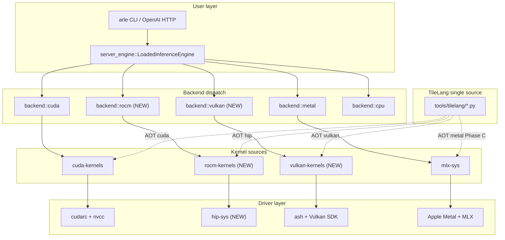
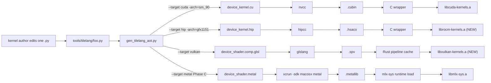
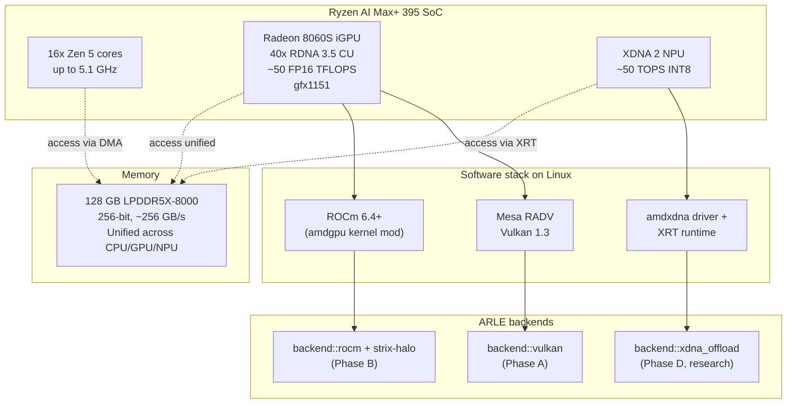
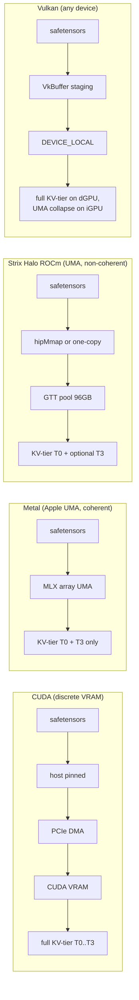
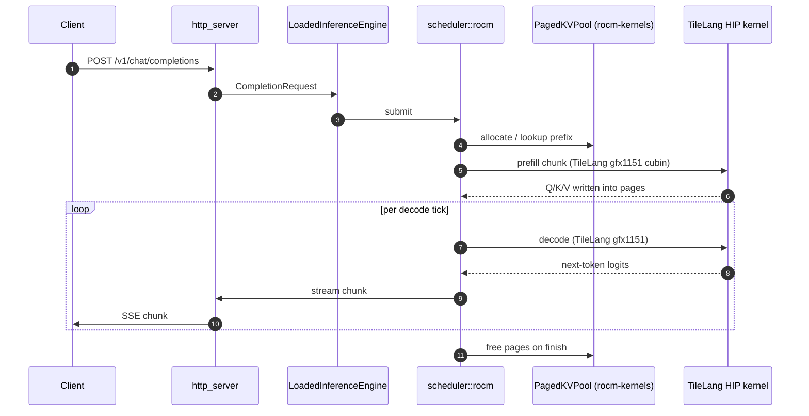

# Multi-Backend Architecture: TileLang Unified Kernel Layer + AMD/Vulkan Backends

Date: 2026-05-05
Branch: `claude/multi-backend-architecture-design-cgtFr`
Owner: ckl
Status: Plan, awaiting user sign-off

Cross-links:
- [`docs/architecture.md`](../architecture.md) — package boundaries (the new crates land under existing rules)
- [`docs/codebase-map.md`](../codebase-map.md) — workspace topology that this plan extends
- [`docs/plans/tilelang-integration.md`](tilelang-integration.md) — Phase-0/1 CUDA TileLang AOT track this plan generalizes
- [`docs/plans/cuda-kernel-crate-extraction.md`](cuda-kernel-crate-extraction.md) — the "one kernel crate per backend" governance this plan reuses
- [`docs/projects/2026-05-02-tilekernels-integration-decision.md`](../projects/2026-05-02-tilekernels-integration-decision.md) — why we port TileLang sources rather than submodule
- [`docs/plans/sm-coverage.md`](sm-coverage.md) — SM tier policy, mirrored here for HIP `gfx*` and Vulkan device classes
- [`infer/src/backend/AGENTS.md`](../../infer/src/backend/AGENTS.md) — backend trait + extension pattern
- [`crates/cuda-kernels/AGENTS.md`](../../crates/cuda-kernels/AGENTS.md) — prelude discipline + AOT pattern
- [`crates/mlx-sys/AGENTS.md`](../../crates/mlx-sys/AGENTS.md) — bridge model the new sys crates mirror

---

## 0 · TL;DR

We add **two new inference backends** to ARLE — **ROCm** (AMD GPU /
APU, including the Ryzen AI Max+ 395 "Strix Halo" iGPU) and **Vulkan**
(portable compute) — and we make **TileLang the single source of truth
for performance-critical kernels** so each kernel author writes one
Python file that AOT-compiles to **CUDA, HIP, Metal, and Vulkan**
artifacts.

Priority order is **explicit and user-set**:

1. **Phase A — Strix Halo (AMD Ryzen AI Max+ 395) first.** Our beachhead is
   the gfx1151 APU with 96–128 GB unified memory. We ship Vulkan first
   (driver-stable today on Mesa RADV) and ROCm second (gfx1151 stabilising
   in ROCm 6.4+). Strix Halo is one box — no scheduler, no PCIe, no
   multi-GPU coordination — so it's the lowest-risk place to prove the
   new layering before we touch anything multi-tenant.
2. **Phase B — General ROCm.** Once Strix Halo is green, fan out to
   gfx942 (MI300X), gfx1100 (RX 7900), gfx1201 (RX 9000) using the same
   HIP build chain.
3. **Phase C — TileLang multi-target unification.** Retire per-backend
   hand-written kernels (CUDA-C / Triton / MLX-bridge composition)
   wherever a TileLang source can replace them without regression. Existing
   FlashInfer / MLX paths stay until each TileLang variant beats them on
   a real bench.
4. **Phase D — XDNA 2 NPU offload (research).** Strix Halo ships a 50-TOPS
   XDNA 2 NPU. Investigate prefill / draft-model offload via the AMD
   IRON/AIE stack. Off the critical path — opens after C.

**Upstream escalation rule (user directive):** every gap we hit in
TileLang during this work — missing target, missing primitive, missing
intrinsic, missing tuning option — is filed as an **upstream PR or
issue** at `tile-ai/tilelang` before we fork or work around. Each phase
below has an explicit "What to PR upstream" subsection. We track open
upstream PRs in `docs/research/tilelang-upstream-prs.md` (created by
this plan).

**Default builds are byte-identical to today.** All new code is gated
behind cargo features (`rocm`, `vulkan`, `xdna`, `tilelang-hip`,
`tilelang-vulkan`, `tilelang-metal-runtime`). No half-states left in
the tree (`feedback_no_half_states.md`).

---

## 1 · Why this shape

### 1.1 Why Strix Halo first

| Property | Strix Halo (gfx1151) | Implication for ARLE |
|----------|----------------------|----------------------|
| 128 GB LPDDR5X-8000, 256-bit, ~256 GB/s | Unified VRAM/RAM, no PCIe | Mental model = Apple Silicon. Reuse Metal-side lessons. |
| 40 RDNA 3.5 CUs @ ~2.9 GHz, ~50 FP16 TFLOPS | Single-box, no NCCL | Continuous batching but no distributed scaffolding needed. |
| Linux ROCm 6.4+ supports gfx1151 | HIP path works (alpha) | We can target HIP today; treat as alpha tier. |
| Mesa RADV Vulkan driver is mature on RDNA 3.5 | Vulkan compute works today | Vulkan is the de-risked first landing. |
| XDNA 2 NPU @ ~50 TOPS INT8 | Separate accelerator | Optional Phase D — not on the critical path. |
| Single SoC, one Linux box | No cluster, no PCIe staging | Lowest-risk environment to prove the new layering. |

The strategic reason: Strix Halo is the **first commodity device that
runs a 30-70B-class model entirely in unified memory at edge prices**.
A working ARLE on Strix Halo is materially differentiated from
llama.cpp / MLX / vLLM today, because:

- llama.cpp ROCm/Vulkan paths exist but lack continuous batching,
  prefix cache, paged-KV, FlashInfer-class attention.
- MLX is Apple-only.
- vLLM ROCm targets dGPU (gfx942), not the consumer APU class.
- Our scheduler + paged-KV + prefix cache + KV-tier work on this box
  with no porting *if we get the kernel layer right*.

### 1.2 Why TileLang as the unifying kernel DSL

We already have three kernel-authoring surfaces in the tree
(CUDA C in `crates/cuda-kernels/csrc/`, Triton AOT in
`crates/cuda-kernels/tools/triton/`, TileLang AOT in
`crates/cuda-kernels/tools/tilelang/`) and Metal (MLX-bridge composition
in `crates/mlx-sys/src/mlx_bridge.cpp`). Adding ROCm and Vulkan with
hand-written HIP / GLSL/SPIR-V would push that to **five**.

TileLang gives us four targets from one source:

| TileLang target | Driver runtime | Status as of 2026-05 |
|-----------------|-----------------|----------------------|
| `cuda` | nvcc → PTX/cubin → cudarc | Production today (HD128 prefill+decode, HD256 prefill+decode) |
| `hip` | hipcc / clang → ISA → hip-rt | Upstream landed late 2025; tested gfx942/gfx1100; gfx1151 alpha |
| `metal` | apple metal-cpp | Experimental upstream PR; ARLE has dev-shim wrapper today |
| `vulkan` | glslang / dxc → SPIR-V → ash | Experimental upstream; cooperative-matrix on AMD via `VK_KHR_cooperative_matrix` (Mesa 25.x) |
| `cpu` (LLVM) | LLVM IR → JIT or AOT | Production for unit tests on no-GPU boxes |

The TileLang authoring shape (T.Pipelined / T.copy / T.gemm / T.fill /
T.reduce / explicit shared-mem) maps well to all four GPU IRs — that's
the whole point of the project. Where it doesn't (today: paged-KV
intrinsics on Vulkan, scalar-block FP8 on RDNA, MFMA on CDNA), §11 lists
the upstream PRs we file.

### 1.3 What this plan is NOT

- **Not a rewrite.** CUDA stays CUDA. The existing Triton-AOT decode
  kernels, FlashInfer paths, and MLX C++ bridge are kept *until* a
  TileLang variant beats them on a measured bench. "Beat" = ≥10% on the
  guidellm metric per `docs/plans/tilelang-integration.md` §5.
- **Not multi-GPU work.** Strix Halo is a single-SoC target. The F0–F4
  multi-GPU scaffold under `infer/src/distributed/` is unchanged. ROCm
  multi-GPU (RCCL) is out of scope for this plan and tracked in a
  separate ticket once Phase B completes.
- **Not training.** `crates/autograd` and `crates/train` see no edits in
  this plan. Train's `Backend` trait can later adopt the new sys crates,
  but that follow-up is gated by inference acceptance.
- **Not a TileLang fork.** Per user directive, every gap is filed
  upstream first. We only fork-pin if upstream rejects within a defined
  SLA (§14).

---

## 2 · Hardware target matrix

| Tier | Target class | Devices | Driver path | Plan phase | Status |
|------|--------------|---------|-------------|-----------|--------|
| T1-CUDA | NVIDIA SM 80/86/89/90 | A100, A10/A40, L4, RTX 3090/4090, H100 | cudarc + FlashInfer + Triton + TileLang-CUDA | shipped | production |
| T1-Metal | Apple M1/M2/M3/M4 | M-series, all | mlx-sys + MLX | shipped | production |
| **T1-ROCm-APU** | **AMD gfx1151 (RDNA 3.5)** | **Ryzen AI Max+ 395** | **hip-sys + ROCm 6.4+ + TileLang-HIP** | **A → B** | **target** |
| T1-Vulkan-AMD | AMD RDNA 3 / 3.5 / 4 | RX 7900, RX 8060S iGPU, RX 9000 | ash + RADV + TileLang-Vulkan | A | target |
| T2-ROCm-dGPU | gfx942 (CDNA 3) | MI300X | hip-sys + ROCm + TileLang-HIP (CDNA path) | B | follow-on |
| T2-ROCm-dGPU | gfx1100 (RDNA 3) | RX 7900 XT/XTX | hip-sys + ROCm + TileLang-HIP | B | follow-on |
| T2-ROCm-dGPU | gfx1201 (RDNA 4) | RX 9070 XT etc. | hip-sys + ROCm + TileLang-HIP | B | follow-on |
| T2-Vulkan-NV | NVIDIA Turing+ | RTX 20/30/40-series | ash + NVIDIA driver + TileLang-Vulkan | C | portable fallback |
| T2-Vulkan-Intel | Intel Xe / Arc | A770 etc. | ash + ANV + TileLang-Vulkan | C | portable fallback |
| T3-XDNA | AMD XDNA 2 NPU | Ryzen AI Max+ 395 NPU tile | xdna-sys + IRON / AIE-RT | D (research) | research |
| T3-CPU | x86_64 / arm64 | any | TileLang-CPU (LLVM) | D | smoke / fallback |

**SM-tier policy mirror.** For ROCm we adopt a parallel tier table to
[`sm-coverage.md`](sm-coverage.md). The build script auto-detects
target archs in this order:

1. `ROCM_ARCH_LIST="gfx1151;gfx1100;gfx942"` env (mirror of `TORCH_CUDA_ARCH_LIST`)
2. `rocminfo | grep gfx` (mirror of `nvidia-smi --query-gpu=compute_cap`)
3. T1 fallback set `{gfx1151, gfx1100, gfx942}` with a `cargo:warning`
4. T3 (`gfx900`/`gfx906`/`gfx908`) → `panic!` at build time, suggest a
   working `ROCM_ARCH_LIST`.

For Vulkan we don't compile per-arch (SPIR-V is the binary); we instead
**auto-detect required device features at runtime** and refuse to start
if they're missing, with a clear "your driver lacks X" error. See §7.4.

### 2.1 Strix Halo specifics (gfx1151)

Locked-in facts that drive design:

| Fact | Source | Design impact |
|------|--------|---------------|
| Up to 128 GB LPDDR5X unified memory; on Linux up to ~96 GB allocatable as VRAM via `amdgpu.gttsize` | AMD spec | One pool. No T1 host-pinned tier, no T2 NVMe tier on hot path. KV-tier collapses to T0+T3 (T3 = remote / shared-fs only). |
| ~256 GB/s aggregate memory bandwidth | LPDDR5X-8000 × 256-bit | Memory-bound. Optimisations that worked on H100 (compute-bound) don't transfer; Metal-side lessons (lazy graph, count objects) do. |
| 40 RDNA 3.5 CUs, ~50 FP16 TFLOPS, no MFMA | RDNA arch | No CDNA `__builtin_amdgcn_mfma_*`; we use `v_wmma_*` (RDNA 3 WMMA) intrinsics. TileLang HIP backend already supports both — verify §11. |
| `wmma` matrix tile shapes: 16×16×16 BF16 | RDNA 3.5 ISA | TileLang `T.gemm` with these shapes; smaller than CDNA's 32×32×16. AOT specialisation goes per-arch. |
| ROCm 6.4+ ships gfx1151 support | Vendor docs | We pin ROCm ≥ 6.4 in CI and fail fast on older. |
| Vulkan compute via Mesa RADV stable on RDNA 3.5 | Mesa 25.x | Vulkan is the safer Phase A landing zone. |
| XDNA 2 NPU at ~50 TOPS INT8 (separate die tile) | AMD spec | Distinct device, distinct driver (`amdxdna`), distinct memory map. Phase D only. |

**Single-box implication.** The continuous-batching scheduler and
prefix cache can run unmodified — they assume one device, one stream,
one paged pool. The KV-tier coordinator simplifies: T1 (host-pinned)
becomes a no-op like Metal; T2 (NVMe) is optional and mostly redundant
with the 96 GB VRAM headroom for medium models.

---

## 3 · Current state (2026-05-05)

What exists and works today (production):

- `infer::backend::cuda` — CUDA backend with continuous batching, paged
  KV (`page_size=16`), prefix cache, FlashInfer prefill HD128/HD256,
  FlashInfer decode HD128, Triton-AOT single-token decode (Qwen3),
  TileLang prefill HD128 / prefill HD256 / decode HD256 (default-on
  with `tilelang-attn`).
- `infer::backend::metal` — Metal backend via `mlx-sys` C++ bridge.
  Continuous batching with packed varlen decode (`BatchKVCache` pattern),
  optional DFlash speculative decode, Qwen3 + Qwen3.5.
- `infer::backend::cpu` — synthetic dev backend (309 lines).
- `crates/cuda-kernels/` — extracted CUDA kernel crate. Owns CUDA C
  sources, Triton AOT, TileLang-CUDA AOT, paged KV, FlashInfer wrapper,
  CUDA graph pool, tensor abstractions. Build script handles per-SM
  fat-binary AOT for both Triton and TileLang (CUDA only).
- `crates/mlx-sys/` — single Metal bridge, vendored MLX, no `.metal`
  files in repo.
- TileLang authoring already covers four kernels: HD128 prefill, HD128
  decode (alias to prefill cubin via Tranche 4), HD256 prefill, HD256
  decode.
- TileLang Metal dev shim: `scripts/tilelang_metal_dev_backend.sh`
  exists, lowers `batch_prefill_paged_hd128.py` to Metal, runs `T.gemm`
  on MPS for smoke/bench. **Production Metal still uses MLX-bridge
  composition; the TileLang Metal runtime path is not wired.**

What does **not** exist:

- Any HIP / ROCm code.
- Any Vulkan code.
- TileLang AOT for non-CUDA targets in production.
- A trait or enum-arm that lets `LoadedInferenceEngine` dispatch to
  ROCm or Vulkan.
- An XDNA / NPU surface.

---

## 4 · Top-level architecture (3 layers + 1 dispatcher)

```
                  ┌────────────────────────────────────────────────┐
                  │              infer::server_engine              │
                  │  LoadedInferenceEngine (enum, one arm/backend) │
                  │  CompletionRequest / Output / Stream / TokenU  │
                  └──────────┬───────────┬───────────┬─────────────┘
                             │           │           │
                ┌────────────▼┐ ┌────────▼┐ ┌────────▼┐ ┌──────────┐
        Layer-D │  CUDA bkend │ │Metal bk │ │ ROCm bk │ │ Vulkan bk│
        (back-  │  (cudarc)   │ │(mlx-sys)│ │(hip-sys)│ │ (ash)    │
         end)   │ scheduler/ │ │scheduler│ │scheduler│ │ scheduler│
                │ cuda/      │ │/metal/  │ │/rocm/   │ │ /vulkan/ │
                └────┬───────┘ └────┬────┘ └────┬────┘ └────┬─────┘
                     │              │           │           │
                ┌────▼──────────────▼───────────▼───────────▼─────┐
        Layer-K │  Kernel layer — one of:                         │
        (kernel │   • TileLang AOT artifact (cubin/codeobj/spirv) │
         port)  │   • Hand-CUDA (csrc/), Triton AOT, FlashInfer   │
                │   • MLX op composition (Metal only)             │
                └────┬──────────────┬───────────┬───────────┬─────┘
                     │              │           │           │
                ┌────▼──────────────▼───────────▼───────────▼─────┐
        Layer-M │  Memory + device primitives                     │
        (mem)   │   DeviceContext / DeviceVec / DeviceMatrix      │
                │   PagedKVPool / HiddenStates                    │
                │   per-backend: nvrtc ctx / mlx stream / hip ctx │
                │                / vk Queue + memory allocator    │
                └────┬──────────────┬───────────┬───────────┬─────┘
                     │              │           │           │
                ┌────▼┐  ┌──────────▼┐  ┌──────▼─┐  ┌──────▼──┐
        Layer-S │cudarc│ │mlx-sys/MLX│ │ hip-sys│  │   ash   │
        (sys)   └──────┘ └───────────┘ └────────┘  └─────────┘
                  PCIe        Apple        ROCm 6      Vulkan 1.3
                  CUDA      Silicon       (AMDGPU      drivers
                            (UMA)        kernel mod)   (any)
```

- **Layer-S (sys / driver):** thin `*-sys` crates owning FFI to vendor
  runtime. New: `hip-sys`, `vk-kernels-sys` (uses `ash` upstream rather
  than rolling our own). Also new (Phase D): `xdna-sys`.
- **Layer-M (memory / device):** per-backend implementation of the
  same five concrete types (`DeviceContext`, `DeviceVec`, `DeviceMatrix`,
  `HiddenStates`, `PagedKVPool`). Today these are CUDA-specific and live
  in `crates/cuda-kernels/`. Plan: extract a tiny shared trait crate
  (`runtime-mem`) so each backend can implement it. See §6 for the exact
  trait and the prelude-discipline rules we keep.
- **Layer-K (kernel):** the heart of the change. TileLang's Python
  source is the **single editable surface**; AOT codegen produces one
  artifact per (kernel, target, arch) tuple. Existing CUDA-C and Triton
  kernels stay until replaced.
- **Layer-D (backend):** existing `InferenceBackend` trait
  (`infer/src/backend.rs`) stays. Each new backend implements it. The
  dispatch enum at `server_engine::LoadedInferenceEngine` gets two new
  arms (`Rocm`, `Vulkan`).

**Hard rule that the existing prelude discipline already enforces and
this plan extends:** Layer-K must not depend on any model code. Layer-M
must not depend on any kernel. Layer-D consumes both via trait
boundaries. Reverse dependencies are rejected on sight (see
`crates/cuda-kernels/AGENTS.md` §Prelude discipline). The same rule
applies to `crates/rocm-kernels` and `crates/vulkan-kernels`.

---

## 5 · New crates

We add **three** new crates and (Phase D) one optional. We deliberately
do **not** create an `infer-runtime-mem` crate today — only a trait
module — to avoid the one-consumer split that
`docs/architecture.md §Active anti-goals` warns against. The crates we
add only land because each has ≥2 direct consumers from day one.

### 5.1 `crates/rocm-kernels/`

Mirror of `crates/cuda-kernels/` for AMD GPUs. Direct consumers:
`infer::backend::rocm` (Phase A/B), `crates/autograd::backend::rocm`
(deferred Phase B+).

```
crates/rocm-kernels/
├── Cargo.toml           # features: rocm (default), no-rocm (compile-without-hipcc),
│                        #   tilelang-hip (default), wmma (RDNA3+),
│                        #   mfma (CDNA), gfx1151-only (Strix-Halo dev shortcut)
├── build.rs             # gfx auto-detect (ROCM_ARCH_LIST → rocminfo → T1 set),
│                        # TileLang-HIP AOT compile loop, hipcc compile of csrc/,
│                        # link `-lhipblas -lhsa-runtime64 -lamdhip64`
├── csrc/                # HIP C++ sources — same subdir layout as CUDA
│   ├── common.hpp
│   ├── attention/       # paged prefill / decode if/when we keep hand-HIP
│   ├── gemm/            # quantized gemv (Marlin-equivalent for RDNA)
│   ├── kv/              # kv_cache_to_paged, kv_quant, paged_kv_append, scatter_kv
│   ├── quant/           # weight quant
│   └── misc/
├── src/
│   ├── lib.rs           # pub mod decls, feature gates
│   ├── prelude.rs       # SAME 5–7 symbols as cuda-kernels, but HIP-flavoured
│   ├── ffi.rs + ffi/    # extern "C" decls (one wrapper per kernel family)
│   ├── tensor.rs        # DeviceContext / DeviceVec / DeviceMatrix / HiddenStates
│   │                    # impl over hip-sys
│   ├── paged_kv.rs      # PagedKVPool — same page_size=16 layout as CUDA
│   ├── graph_pool.rs    # HIP graph capture/replay (where ROCm supports it)
│   ├── kv_quant.rs
│   └── kv_types.rs      # KVCacheDtype / KVFormat (re-export of shared enum)
└── tools/
    └── tilelang/        # SAME .py kernel modules as cuda-kernels/tools/tilelang/,
                         # but the AOT generator passes target="hip -arch=gfx1151"
                         # etc. Likely SYMLINKED to cuda-kernels/tools/tilelang/
                         # (single source of truth — see §7.6).
```

**Why a separate crate, not a feature flag inside `cuda-kernels`?**

Because adding `feature = "rocm"` to `cuda-kernels` would force every
consumer of the existing CUDA prelude to compile against HIP headers
when they didn't ask, and `cudarc` + `hip-sys` have overlapping symbol
names (`hipMalloc`/`cudaMalloc`, `hipStream_t`/`cudaStream_t`).
Architecturally one crate per accelerator runtime is cleaner. The
existing crate-split governance §`docs/architecture.md` requires ≥2
direct consumers per new crate — `infer` + `autograd` both qualify.

### 5.2 `crates/vulkan-kernels/`

Vulkan compute kernel layer. Direct consumers: `infer::backend::vulkan`
(Phase A), `crates/autograd::backend::vulkan` (deferred). Also targets
non-AMD devices (NVIDIA Vulkan, Intel Vulkan), so this is not redundant
with `rocm-kernels` even when running on AMD.

```
crates/vulkan-kernels/
├── Cargo.toml           # features: vulkan (default), tilelang-vulkan (default),
│                        #   coopmat (VK_KHR_cooperative_matrix), no-vulkan
├── build.rs             # TileLang→SPIR-V AOT compile loop;
│                        # glslang/dxc fallback for hand-GLSL kernels;
│                        # bundled SPIR-V validator (spirv-val) sanity gate
├── shaders/             # hand-GLSL kernels for the few things TileLang
│                        # cannot express today (small fp16 reductions,
│                        # subgroup tricks). Compiled at build time.
│   ├── common.glsl
│   └── ...
├── src/
│   ├── lib.rs
│   ├── prelude.rs       # mirror of cuda-kernels prelude
│   ├── instance.rs      # ash::Instance bring-up, layer/extension list
│   ├── device.rs        # physical-device selection, queue family mapping
│   ├── memory.rs        # gpu_allocator-based DeviceVec / DeviceMatrix
│   ├── tensor.rs        # DeviceContext: Queue + Allocator + descriptor pools
│   ├── paged_kv.rs      # PagedKVPool over storage buffers
│   ├── pipeline.rs      # SPIR-V → ComputePipeline cache
│   ├── ffi.rs           # uniform "launch(kernel_id, grid, args[])" surface
│   └── kv_types.rs
└── tools/
    └── tilelang/        # symlink to cuda-kernels/tools/tilelang/ (same as rocm)
```

The Vulkan crate's "FFI" is a Rust-internal launch dispatcher rather
than an `extern "C"` ABI — TileLang's Vulkan target emits a SPIR-V blob
and a small launch description (workgroup size, push-constant layout,
descriptor set bindings). The crate's job is to take that descriptor +
runtime args and call `vkCmdDispatch`. There is no per-target hipcc /
nvcc step at runtime.

### 5.3 `crates/hip-sys/`

`*-sys` crate for the HIP runtime + hipBLAS + (where stable) hipBLASLt.
Direct consumers: `crates/rocm-kernels`, `crates/autograd::backend::rocm`
(deferred). We do **not** vendor the HIP SDK — we link against the
system ROCm install and require `ROCM_PATH` env or
`/opt/rocm` default.

```
crates/hip-sys/
├── Cargo.toml           # build-deps: bindgen
├── build.rs             # ROCM_PATH discovery, bindgen run, link line emission
├── src/
│   └── lib.rs           # extern "C" via bindgen-generated bindings
└── README.md
```

We considered using the existing `hip-runtime-sys` crate from
crates.io (third-party `hip-rt`/`hip-sys` exist but most are stale and
don't track ROCm 6.4 cleanly). A vendored bindgen run, pinned to ROCm
6.4 headers, is cheaper to maintain than chasing an upstream that
doesn't share our timeline. The `*-sys` boundary is justified because
**`autograd` will consume HIP separately from `infer`**, matching the
two-consumer requirement.

### 5.4 `crates/xdna-sys/` (Phase D, research only)

Bridge to AMD's XDNA 2 NPU via the `amdxdna` Linux driver and the AIE
runtime / IRON Python toolkit. Owner-status only; not on the critical
path. Direct consumers (proposed): `infer::backend::xdna_offload` (a
small offload helper, not a full backend). We hold this out of the
workspace until Phase D actually starts.

### 5.5 What we are NOT creating

Per `docs/architecture.md §Active anti-goals`:

- **No `infer-runtime-mem` crate.** A trait module inside `infer`
  (`infer::backend::mem`) holds the shared memory abstractions. Two
  consumers (`backend/rocm`, `backend/vulkan`) is the floor; if a third
  emerges we revisit.
- **No `infer-kernel-trait` crate.** Each backend's kernel layer is its
  own crate (`cuda-kernels`, `rocm-kernels`, `vulkan-kernels`); they
  share *conventions* (prelude discipline, AOT pattern) not types.
- **No premature TileLang fork.** Per user directive, all upstream gaps
  are filed as PRs first; pin-and-fork only after rejection.

---

## 6 · Backend module layout

### 6.1 ROCm (`infer/src/backend/rocm/`)

```
infer/src/backend/rocm.rs            — module root + thin re-export shim
                                       (mirrors backend/cuda.rs ~15 lines)
infer/src/backend/rocm/
├── AGENTS.md                        — guide for future edits
├── bootstrap.rs                     — model loading, runtime config, scheduler bring-up
│                                       (mirror of backend/cuda/bootstrap.rs)
├── kv_pool.rs                       — re-export from rocm-kernels::PagedKVPool
└── notes.md                         — Strix-Halo-specific knobs & gotchas
infer/src/scheduler/rocm/            — production ROCm scheduler
├── mod.rs
├── runtime.rs                       — continuous batching loop
├── prefill_path.rs                  — chunked prefill
├── decode_path.rs                   — paged decode
└── spec_path.rs                     — spec-decode integration (Phase B+)
```

**Reuse policy.** The CUDA scheduler under `infer/src/scheduler/cuda/`
is not extracted — per the active anti-goal in `architecture.md`, we
don't pretend it's portable. Instead we **copy** the parts we need into
`scheduler/rocm/` and converge by deletion as we discover real shared
shape. Two scheduler files that look 90% the same is fine; a premature
abstraction is not.

### 6.2 Vulkan (`infer/src/backend/vulkan/`)

```
infer/src/backend/vulkan.rs          — module root
infer/src/backend/vulkan/
├── AGENTS.md
├── bootstrap.rs                     — instance/device pick, queue setup
├── forward.rs                       — Qwen3 forward via vulkan-kernels ops
├── kv_pool.rs                       — re-export PagedKVPool from vulkan-kernels
├── ops.rs                           — thin wrappers: linear, rms_norm, attention
├── runtime.rs                       — single-request runtime (Phase A1) or
│                                       continuous-batching scheduler (Phase A2)
└── notes.md
```

Phase A1 ships single-request via `BackendRuntimeHandle` (the same
serial path Metal + CPU use today). Phase A2 promotes Vulkan to its own
scheduler **only if** the bench shows the serial path bottlenecks the
machine. We do not pre-build a multi-request scheduler before evidence
demands it.

### 6.3 Strix Halo specific tuning

The `rocm` backend gets a **Strix-Halo-specialised path**, gated by
`#[cfg(feature = "strix-halo")]` (turns on automatically when the
device-runtime detects gfx1151). Lives in
`infer/src/backend/rocm/strix_halo.rs`. Specifics:

- **Unified-memory KV pool.** No host-pinned tier — KV pool allocates
  in the GTT-backed unified region; CPU reads are valid. Mirrors the
  Metal mental model from `backend/metal/AGENTS.md` Invariant #2.
- **No PCIe staging.** Weight loader skips the host→device copy step;
  weights are mapped directly from disk via `ROCmHsaMmap` where
  available, falling back to a single user-space copy.
- **Reduced KV-tier coordinator.** T1 (host pinned) collapses to T0
  (device); T2 (NVMe) is optional and off by default. Coordinator
  skips queue/backpressure for the T0↔T1 path.
- **Wave size + WMMA tile shapes.** TileLang HIP target is invoked
  with `-arch=gfx1151 -mwavefrontsize64 -DARLE_WMMA_TILE=16x16x16_bf16`.
  CDNA targets pass `-DARLE_MFMA_TILE=32x32x16_bf16` instead (see §7.4).
- **Memory bandwidth dominates compute.** The numerical-optimisation
  emphasis is on minimising DRAM traffic per token (KV layout, fused
  RMS-norm + RoPE + KV write) rather than GEMM occupancy.

### 6.4 Dispatch wiring

`server_engine::LoadedInferenceEngine` gains two new arms:

```rust
pub enum LoadedInferenceEngine {
    #[cfg(feature = "cuda")]   Qwen3Cuda(...),    // existing
    #[cfg(feature = "cuda")]   Qwen35Cuda(...),   // existing
    #[cfg(feature = "cuda")]   Qwen35MoeCuda(...),// existing
    #[cfg(feature = "metal")]  Metal(BackendInferenceEngine<MetalBackend>),  // existing
    #[cfg(feature = "cpu")]    Cpu(BackendInferenceEngine<CpuBackend>),      // existing
    #[cfg(feature = "rocm")]   Rocm(BackendInferenceEngine<RocmBackend>),    // NEW Phase A
    #[cfg(feature = "vulkan")] Vulkan(BackendInferenceEngine<VulkanBackend>),// NEW Phase A
}
```

`BackendInferenceEngine` is the same generic wrapper Metal + CPU use
today — no new dispatch infra. Mutually exclusive at runtime: a binary
picks one backend at startup based on feature set + device probe.

### 6.5 Shared memory traits (the "trait module, not a crate" piece)

New file: `infer/src/backend/mem.rs`. Exports the cross-backend trait
that each backend's `DeviceContext` / `DeviceVec` / `DeviceMatrix`
implements. The `infer-cuda-kernels` types impl this trait; ROCm and
Vulkan ditto. **CUDA-side impl is purely additive — no rename of
existing types.**

```rust
pub trait DeviceCtx: Send {
    type Stream;        // CUDA: stream_t; ROCm: hipStream_t; Vulkan: command-buffer
    type Allocator;     // backend-specific
    fn synchronize(&self) -> anyhow::Result<()>;
    fn name(&self) -> &'static str;
}

pub trait DeviceBuf: Send {
    fn len_bytes(&self) -> usize;
    fn as_raw_ptr(&self) -> RawDevicePtr;  // opaque; only kernel layer dereferences
}

// PagedKVPool stays per-backend. No cross-backend type. Reason: page
// indirection is too tightly coupled to the storage primitive (linear
// CUDA alloc vs Vulkan VkBuffer with a device-local memory type).
```

Intentionally narrow. We are not building a CUDA-flavoured Vulkan
abstraction; we are agreeing on the *minimum* contract the
`server_engine` and scheduler-shared bits need to dispatch.

---

## 7 · TileLang multi-target AOT pipeline

This is the central machinery. Today
`crates/cuda-kernels/build.rs` runs TileLang AOT with `target="cuda"`
only. This section generalises that to four targets while keeping the
existing Phase-0/1 CUDA path byte-for-byte unchanged.

### 7.1 Authoring contract (one Python module → four artifacts)

A TileLang kernel module exposes:

```python
SUPPORTED_HEADS: list[tuple[int, int]]   # (num_q_heads, num_kv_heads)
SUPPORTED_TARGETS: list[str]             # subset of {"cuda","hip","metal","vulkan","cpu"}

def get_kernel(num_q_heads: int, num_kv_heads: int, target: str):
    """Return a JITSpec compatible with tilelang.compile(target=target)."""
```

The existing modules
(`batch_prefill_paged_hd128.py`,
 `batch_prefill_paged_hd256.py`,
 `batch_decode_paged_hd256.py`)
gain a `target` parameter and a `SUPPORTED_TARGETS` list. Defaults:
HD128 ships `["cuda", "hip"]` first; HD256 follows; Vulkan and Metal
runtime ship in Phase C once parity is shown on small kernels first
(rms_norm, silu_mul, embedding).

### 7.2 Generator: `gen_tilelang_aot.py` becomes target-aware

Today `crates/cuda-kernels/tools/tilelang/gen_tilelang_aot.py` emits
CUDA-only artifacts. It already takes `--target "cuda -arch=sm_<sm>"`.
We extend the parser to:

| `--target` value | Output contract |
|------------------|-----------------|
| `cuda -arch=sm_NN` | Today: `device_kernel.cu` → nvcc → cubin → C wrapper using `cuModuleLoadData` + `cuLaunchKernel` |
| `hip -arch=gfx1151` (NEW) | TileLang emits `device_kernel.hip.cpp` (or `.cu` with HIP frontend); hipcc → code-object (`.hsaco`); C wrapper uses `hipModuleLoadData` + `hipModuleLaunchKernel` |
| `metal` (NEW, Phase C) | TileLang emits `device_kernel.metal`; metallib via `metal --frontend=metal`; C++ wrapper via `mlx-sys` or direct `metal-cpp` for runtime load |
| `vulkan` (NEW) | TileLang emits SPIR-V (or GLSL → glslang → SPIR-V); Rust-side launcher in `vulkan-kernels::pipeline` consumes the SPIR-V blob + a JSON descriptor with workgroup size, push-constant layout, descriptor set bindings |
| `cpu` (NEW, Phase D) | TileLang emits LLVM IR or C; clang → `.o`; standard `extern "C"` linkage |

Stdout contract is preserved per-target, with `TARGET=...` added so
the build script can dispatch:

```
TARGET=hip
FUNC_NAME=tilelang_batch_prefill_paged_hd128_q32_kv8_gfx1151
ARTIFACT_PATH=/tmp/.../tilelang_aot/.../kernel.hsaco
C_PATH=/tmp/.../tilelang_aot/.../wrapper.c       # absent for vulkan
SPIRV_PATH=/tmp/.../tilelang_aot/.../kernel.spv  # vulkan only
DESC_PATH=/tmp/.../tilelang_aot/.../kernel.json  # vulkan only
```

### 7.3 Per-arch fat-binary dispatch

CUDA already does this: one cubin per (kernel, SM) tuple, plus a
runtime dispatch wrapper that switches on `cuCtxGetDevice` →
`cuDeviceGetAttribute(MAJOR/MINOR)`. TileLang HIP gets the analogous
treatment:

- One `.hsaco` per `(kernel, gfx_arch)` pair, with `gfx_arch`
  drawn from `ROCM_ARCH_LIST`.
- Symbol uniqueness via `_<gfx_arch>` suffix on `kernel_name` and
  `out_name`, identical to TileLang-CUDA's `_sm{sm}` suffix.
- C dispatch wrapper extern-declares every per-arch symbol; runtime
  reads `hipDeviceProp_t.gcnArchName` once per thread (TLS, not a
  pthread_once + global static — same reasoning as the CUDA wrapper:
  multi-GPU could bind threads to different devices).

Vulkan is different: SPIR-V is portable across vendors. We don't
specialise per-arch; we **specialise per feature flag set** instead.
A SPIR-V blob is compiled for each of:

- `coopmat=on / coopmat=off`
- `subgroup_size_16 / subgroup_size_32 / subgroup_size_64`

Runtime picks the matching blob during pipeline creation by reading
`VkPhysicalDeviceProperties` + `VkPhysicalDeviceCooperativeMatrixPropertiesKHR`.

### 7.4 Build script topology

`crates/cuda-kernels/build.rs` keeps its existing TileLang-CUDA loop.
Two new build scripts mirror it:

`crates/rocm-kernels/build.rs`:

```rust
fn main() {
    if cfg!(feature = "no-rocm") { return; }
    let archs = detect_rocm_archs();          // env → rocminfo → T1 fallback
    let py = find_tilelang_python();           // same probe order as cuda
    for spec in TILELANG_HIP_KERNEL_SPECS {
        for arch in &archs {
            let artifact = generate_tilelang_per_arch(
                spec, arch, &py,
                target = format!("hip -arch={arch}"),
            );
            artifacts.push(artifact);
        }
    }
    compile_dispatch_wrapper(&artifacts);
    link_hip_runtime();
}
```

`crates/vulkan-kernels/build.rs`:

```rust
fn main() {
    if cfg!(feature = "no-vulkan") { return; }
    let py = find_tilelang_python();
    let feature_combos = [
        ("coopmat", true),
        ("coopmat", false),
    ];
    for spec in TILELANG_VULKAN_KERNEL_SPECS {
        for (feat, on) in feature_combos {
            let artifact = generate_tilelang_per_features(
                spec, feat, on, &py, target = "vulkan",
            );
            artifacts.push(artifact);
        }
    }
    embed_artifacts(&artifacts);   // include_bytes! the .spv blobs
}
```

We deliberately reuse the **same** `gen_tilelang_aot.py` from
`cuda-kernels/tools/tilelang/`; the new crates symlink to it. Single
source of truth — every kernel author edits one location regardless of
which backend(s) consume the kernel.

### 7.5 `cargo check` cross-target story

Today on Mac without nvcc:
`cargo check -p infer --no-default-features --features cuda,no-cuda`
type-checks the CUDA Rust path against compile-stripped FFI.

We extend the same pattern:

```bash
# Mac without hipcc — type-check the ROCm Rust path
cargo check -p infer --no-default-features --features rocm,no-rocm

# Mac without Vulkan SDK — type-check the Vulkan Rust path
cargo check -p infer --no-default-features --features vulkan,no-vulkan

# Strix-Halo box typecheck guard
cargo check -p infer --no-default-features --features rocm,vulkan
```

The `no-rocm` / `no-vulkan` features make their respective build
scripts short-circuit before invoking external toolchains. `lib.rs`
still declares every `#[cfg(feature = "rocm")]` module so rustc
type-checks them. This is **not** a release config — ops will fail at
runtime. Mirrors the existing `cuda,no-cuda` story precisely.

### 7.6 Single-source-of-truth for kernel `.py` files

All TileLang `.py` kernel modules live in **one** location:
`crates/cuda-kernels/tools/tilelang/`. The other kernel crates symlink
that directory:

- `crates/rocm-kernels/tools/tilelang/` → symlink to
  `crates/cuda-kernels/tools/tilelang/`
- `crates/vulkan-kernels/tools/tilelang/` → symlink to
  `crates/cuda-kernels/tools/tilelang/`

We do this rather than move the directory to a "neutral" location
(e.g. `crates/tilelang-kernels/`) because moving would break the dozen
cargo-build-system paths and rerun-if-changed declarations that
reference the existing location. Symlinks are zero-cost on
Linux/macOS; Windows is not on the support list.

If cross-platform symlink trouble emerges, the fallback is to add a
rerun-if-changed declaration in each new crate's build.rs that points
at the canonical path, plus a tiny `tools/tilelang/.gitkeep`
relative-path shim. We'll cross that bridge at build time, not now.

### 7.7 What to PR upstream to TileLang

Per user directive — every gap we hit, file upstream first. Tracking
file: `docs/research/tilelang-upstream-prs.md`. Concrete known gaps
that this plan presumes will need PRs:

| Gap | Why we need it | PR shape |
|-----|----------------|----------|
| `target="hip -arch=gfx1151"` end-to-end | RDNA 3.5 / Strix Halo support | Add gfx1151 to TileLang's HIP target lookup; add WMMA-16x16x16-bf16 lowering; verify `T.gemm` lowering hits `v_wmma_*` intrinsics |
| Paged-KV `BatchPrefill` primitives on HIP | Phase B kernel parity with CUDA | Add HIP analogue of the CUDA paged-KV intrinsics already used in `batch_prefill_paged_hd128.py` (mostly a target-flag plumbing PR — kernel logic already lowers). |
| Vulkan `T.gemm` with `VK_KHR_cooperative_matrix` | Decent prefill perf on AMD/NV via Vulkan | Verify cooperative-matrix path in the upstream Vulkan target; if absent, add lowering. |
| `target="metal"` runtime-loadable artifact (not just dev shim) | Phase C Metal port | Currently the upstream Metal target builds `.metal` shaders for an experimental flow; we need a stable artifact contract (header + symbol). |
| `target="cpu"` (LLVM JIT or AOT) for unit tests | CI on no-GPU boxes | Smaller PR — most TileLang ops already lower to LLVM via the TVM stack. |
| Specialise scalar-block FP8 cast | DSv4 weight quant on AMD | Upstream `per_block_cast_kernel.py` already does this for CUDA; PR HIP target. |
| Per-row-RoPE intrinsic (mlx-lm `BatchKVCache` shape) | Metal varlen decode parity | Bridge with our existing varlen RoPE invariants on Metal (MLX-side trick). May land as a TileLang user-side helper rather than core. |

Each row above becomes its own upstream issue first, PR second. We do
**not** vendor a TileLang fork until upstream rejects on a defined SLA
(see §14). If a feature is `Approved-but-not-merged`, we cherry-pick
the PR onto our pinned commit and document the cherry-pick set in
`tilelang-upstream-prs.md`.

---

## 8 · Memory model

Three distinct memory worlds — and we treat each one differently rather
than papering over with a fake unified abstraction.

### 8.1 Discrete VRAM (CUDA dGPU, ROCm dGPU, Vulkan dGPU)

- Allocation: device-local memory pool (`cudaMalloc` / `hipMalloc` /
  `VkDeviceMemory(DEVICE_LOCAL)`).
- Transfer: explicit H↔D copies via DMA. Tier-1 host-pinned tier
  active.
- KV-tier: full T0 (device) → T1 (pinned host) → T2 (NVMe) → T3
  (remote) coordinator path, exactly as today.

### 8.2 Apple Silicon UMA (Metal)

- Allocation: `mlx::core::array` lives in unified memory; CPU pointer
  is valid after `eval()`.
- Transfer: no explicit copies. T1 is a no-op.
- KV-tier collapses to T0 + (optional T2 NVMe) + T3 (remote).
- Existing rules in `backend/metal/AGENTS.md` Invariant #2 stand.

### 8.3 Strix Halo UMA (ROCm gfx1151, AI Max+ 395)

This is the new one and it's **mostly** like Metal:

- Allocation: HIP returns a device pointer that maps into the GTT
  (Graphics Translation Table) range backed by system LPDDR5X. With
  `amdgpu.gttsize=...` set high (typical: 96 GB on a 128 GB box), this
  is the dominant allocation surface.
- CPU access: technically possible via `hipHostRegister`-style mapping
  + `hipMemcpyDefault` (peer-cohorent), but **not free** the way Metal
  is — the GPU MMU still caches and the cache-coherency cost is real.
- Transfer: prefer `hipMemcpyDeviceToDevice` even within the same chip;
  it lets the driver elide work where the addresses already alias.
- KV-tier: T1 (host pinned) collapses to a no-op, like Metal. T2
  (NVMe) optional. We **do not** assume Metal-style "no memcpy
  observed = cheap" — gfx1151 still pays page-walk + cache-line costs;
  bench, don't intuit. Mirror of `metal/AGENTS.md` invariant #2 / #6.
- Vulkan-on-Strix-Halo path: same physical memory; allocate via
  `gpu_allocator` with memory type `DEVICE_LOCAL | HOST_VISIBLE` if
  the driver advertises it (Mesa 25.x does), otherwise fall back to
  `DEVICE_LOCAL` + staging.

### 8.4 Vulkan generic (non-AMD)

- Allocation: `gpu_allocator` crate over `VkDeviceMemory`, picking
  memory type based on heap reports.
- Transfer: explicit staging buffers when the device doesn't advertise
  `HOST_VISIBLE | DEVICE_LOCAL` (typical on dGPUs).
- KV-tier: as discrete (full coordinator).

### 8.5 The `MemoryProfile` runtime decision

`infer/src/backend/mem.rs` defines:

```rust
pub enum MemoryProfile {
    Discrete,   // explicit H↔D, full KV-tier
    Uma,        // unified, T1 collapse
    UmaCoherent // unified + cache-coherent (Apple); no extra cost
}

impl MemoryProfile {
    pub fn detect_for(backend: BackendKind, dev: &DeviceInfo) -> Self { ... }
}
```

The KV-tier coordinator branches on this once at startup. Today's
implicit assumption (CUDA = Discrete, Metal = UmaCoherent) becomes
explicit, and Strix Halo gets `Uma` (not `UmaCoherent` — the
non-zero-cost case).

---

## 9 · KV cache + paged-KV layout

The page layout — `page_size = 16` BF16, HND order — is **kept
verbatim** across CUDA, ROCm, and Vulkan. Reasons:

1. It's the layout the existing paged-KV append / scatter / decode
   kernels assume, and we're porting those kernels (TileLang sources)
   verbatim to HIP/Vulkan.
2. Crossing model architectures (Qwen3 HD128, Qwen3.5 HD256, eventual
   DSv4 MLA) is layout-stable on this format.
3. The prefix-cache `RadixNode` byte-counter math depends on it.

Per-backend differences are confined to **how** the page memory is
allocated, not **what** is stored:

| Backend | Page storage | `kv_indices` indirection | Page-write kernel |
|---------|-------------|---------------------------|-------------------|
| CUDA | `cudaMalloc`'d slab; `RawDevicePtr` per page | `int32` device array | TileLang HD128 prefill emits page writes |
| ROCm | `hipMalloc`'d slab | `int32` device array | TileLang HIP variant — same .py kernel, different target |
| Vulkan | `VkBuffer(STORAGE_BUFFER \| TRANSFER_DST)` with sub-allocation | `int32` storage buffer | TileLang Vulkan variant — SPIR-V loads from descriptor binding |
| Metal (existing) | MLX `array` in UMA | int32 array | C++ bridge composition (unchanged in this plan) |

`PagedKVPool` stays per-backend (different storage primitives) but the
**accounting** (free-list, ref counts, COW prefix attach) lives in
`infer::block_manager.rs` — already backend-agnostic. No changes needed.

### 9.1 Strix Halo KV pool sizing

Default budget on a 128 GB box (96 GB GTT mapped):

| Slice | Size | Notes |
|-------|------|-------|
| Weights (Qwen3-32B BF16) | 64 GB | One copy, mmap'd from disk |
| Workspace + scratch | 4 GB | Activation buffers, sample buffers |
| KV pool | 24 GB | ~1.5M BF16 tokens at HD128, num_kv_heads=8 |
| Free margin | 4 GB | Defrag / spike headroom |
| **Total** | **96 GB** | Fits in default GTT |

For Qwen3.5-30B-A3B MoE the breakdown rebalances heavily toward
weights; KV pool drops to ~12 GB. Sizing is a runtime knob, not a
hard-coded constant, mirroring existing CUDA defaults.

---

## 10 · Sampling, RoPE, RMS-norm — TileLang portability

These are the small kernels where the multi-target story matters most.
Each one has three implementations today (CUDA-C / Triton / MLX). We
collapse on TileLang in Phase C, kernel by kernel, with bench gates.

### 10.1 Inventory of small kernels and their current homes

| Op | CUDA today | Metal today | Plan |
|----|-----------|-------------|------|
| RMS-norm | `csrc/misc/rms_norm.cu` + `ops/norm.rs` | MLX `mlx::core::rms_norm` | TileLang `.py` already exists upstream as a sample; verify; promote |
| Fused add+RMS-norm | `csrc/misc/fused_add_rms_norm.cu` | MLX-bridge composition | TileLang authored fresh (small kernel, easy port) |
| RoPE (per-row offsets) | `csrc/attention/prefill_attention_paged_prep.cu` (fused) + `csrc/misc/rope.cu` (unused?) | MLX `fast::rope` with explicit varlen array offsets (per `metal/AGENTS.md` Inv #7) | TileLang author; key gap = per-row offsets — see §7.7 PR row |
| SiLU·mul (gated MLP) | `csrc/misc/silu_mul.cu` + Triton AOT `silu_mul_triton_aot` | MLX composition | TileLang already supports; just port the .py |
| Embedding gather | `csrc/misc/embedding.cu` | MLX `take_axis` | TileLang author |
| Argmax / GPU sample | `csrc/misc/sample.cu` + `ops/sampling.rs` | MLX-side `argmax_with_logprob` | TileLang author (small, easy) |
| Softmax (online, free-standing) | inside attention kernel (fused) | inside MLX scaled_dot_product | Stays fused inside attention; not a separate target |
| Scatter KV (page write outside attention) | `csrc/kv/scatter_kv.cu` | bridge composition | TileLang author (Phase C) |

### 10.2 Bench-gated promotion rule

For each row above, the promotion to TileLang lands behind a
per-kernel feature flag (`tilelang-rmsnorm`, `tilelang-rope`,
`tilelang-silu-mul`, etc.) and is promoted to default-on **only when**
a guidellm sweep on the relevant target shows ≤2% perf delta and ≤1e-3
numerical delta vs the existing path. This is more lenient than the
attention 10% bar because the small kernels aren't the long-tail
bottleneck; the win is uniformity, not raw speed.

The existing `tilelang-attn` flag (now default-on for CUDA) is the
template. Each new kernel flag follows the same lifecycle:

1. Off-by-default behind feature flag, both impls in tree.
2. Bench delta documented in `docs/experience/wins/`.
3. Promote to default-on (a tiny commit, easily revertible).
4. Old impl kept in tree for one cycle, then removed in a deletion-style
   refactor when no other consumer remains. (Per CLAUDE.md "no half
   states".)

### 10.3 Multi-target verification matrix

For each TileLang kernel landing in this phase, we run:

| Target | Test | Driver |
|--------|------|--------|
| CUDA sm_89 (L4) | `cargo test --features cuda,tilelang-X --test e2e` | existing in-tree |
| CUDA sm_90 (H100) | guidellm sweep | remote |
| HIP gfx1151 (Strix Halo) | `cargo test --features rocm,tilelang-X --test e2e_rocm` (NEW) | remote-target |
| HIP gfx942 (MI300X) | guidellm sweep | remote, Phase B |
| Vulkan (any) | `cargo test --features vulkan,tilelang-X --test e2e_vulkan` (NEW) | remote-target |

Tests `e2e_rocm.rs` and `e2e_vulkan.rs` are NEW files mirroring
`infer/tests/e2e.rs`. Same Qwen3-4B JSON baseline. Numerical parity is
asserted by substring match against `infer/test_data/Qwen3-4B.json`,
exactly as today. If parity slips on a new backend, that's a kernel
bug, not an excuse to relax the test.

---

## 11 · Build matrix and feature flags

Cargo features form a small DAG. The shape mirrors today's CUDA story
exactly so reviewers don't learn a new mental model:

| Feature | Implies | Default? | Build effect |
|---------|---------|----------|--------------|
| `cuda` | — | yes (today) | Build CUDA backend; nvcc required |
| `tilelang-attn` | `cuda` | yes (today) | TileLang attention AOT |
| `metal` | — | only on `--no-default-features --features metal` | Build Metal backend; xcode + cmake |
| `cpu` | — | dev only | Synthetic backend |
| **`rocm`** | — | NEW; opt-in | Build ROCm backend; hipcc + ROCm 6.4+ required |
| **`tilelang-hip`** | `rocm` | NEW; default within `rocm` | TileLang HIP AOT |
| **`vulkan`** | — | NEW; opt-in | Build Vulkan backend; Vulkan SDK + glslang |
| **`tilelang-vulkan`** | `vulkan` | NEW; default within `vulkan` | TileLang Vulkan AOT |
| **`strix-halo`** | `rocm` | NEW; auto on gfx1151 detect | Strix-Halo unified-memory specialised path |
| **`xdna`** | — | NEW; Phase D research | XDNA NPU offload helper |
| `no-cuda` / `no-rocm` / `no-vulkan` | — | for typecheck-only builds | Skip the toolchain step |
| `nccl` (existing) | `cuda` | opt-in | NCCL-backed multi-GPU smoke |
| `rccl` (NEW, Phase B+) | `rocm` | opt-in | RCCL-backed multi-AMD-GPU smoke |

Mutually exclusive at runtime, not at compile time. Today
`cuda+metal+cpu` cargo-checks together because the dispatch is at
`LoadedInferenceEngine`. We extend that: `cuda+rocm+vulkan` must
type-check together. Build-time feasibility (do you have nvcc + hipcc
+ vulkan SDK on the same box?) is a CI question, not a typecheck
question.

### 11.1 Reference build commands

```bash
# CUDA today (unchanged)
CUDA_HOME=/usr/local/cuda cargo build --release

# ROCm on a Strix Halo box (Phase A target)
ROCM_PATH=/opt/rocm cargo build --release \
  --no-default-features --features rocm,tilelang-hip

# Vulkan on Strix Halo (Phase A first landing)
cargo build --release --no-default-features --features vulkan,tilelang-vulkan

# Both ROCm + Vulkan on Strix Halo (let the binary pick at startup)
ROCM_PATH=/opt/rocm cargo build --release \
  --no-default-features --features rocm,tilelang-hip,vulkan,tilelang-vulkan

# Type-check guards from a Mac / no-GPU box
cargo check -p infer --no-default-features --features rocm,no-rocm
cargo check -p infer --no-default-features --features vulkan,no-vulkan
cargo check -p infer --no-default-features --features cuda,rocm,vulkan,no-cuda,no-rocm,no-vulkan

# Tests on Strix Halo (target box)
cargo test --release --features rocm,tilelang-hip --test e2e_rocm
cargo test --release --features vulkan,tilelang-vulkan --test e2e_vulkan

# guidellm bench on Strix Halo
INFER_FEATURES=rocm,tilelang-hip scripts/bench_guidellm.sh strix-halo-rocm-baseline
INFER_FEATURES=vulkan,tilelang-vulkan scripts/bench_guidellm.sh strix-halo-vulkan-baseline
```

### 11.2 CI matrix additions

We do not own a CI box that can build all targets. Plan:

- Linux NVIDIA box (existing): `cuda + tilelang-attn` + `cuda,no-cuda`.
- Mac (existing): `metal` + `cuda,no-cuda` + `rocm,no-rocm` (NEW typecheck).
- Strix Halo box (NEW, user's): `rocm + tilelang-hip + vulkan + tilelang-vulkan`.

The Strix Halo box becomes the canonical bench target for AMD until a
dGPU box is added (gfx942 / gfx1100 / gfx1201).

---

## 12 · Phase plan with concrete deliverables

We use the exec phases from CLAUDE.md (Explore → Plan → Implement →
Verify → Reflect) at the **per-phase** granularity. Every phase ends
with a wins-or-errors entry and the bench requirement is honoured.

### Phase A0 — Strix Halo Vulkan smoke (week 1–2)

**Goal:** prove that a TileLang `T.gemm` (no attention, no model) runs
on the Strix Halo iGPU via the Vulkan backend, and that Rust + ash +
SPIR-V loading works end to end.

**Deliverables:**
- `crates/vulkan-kernels/` skeleton: instance, device pick, queue, descriptor set, pipeline cache, run a `gemm.spv` produced by TileLang.
- Build script: TileLang Vulkan target probe; if upstream lacks Vulkan target on `tilelang.compile`, file PR (§7.7 row "Vulkan T.gemm with VK_KHR_cooperative_matrix") and pin to a known-good commit.
- `examples/vulkan_gemm_smoke.rs` runs a 4096×4096 BF16 gemm on the iGPU and prints throughput.

**Acceptance:**
- Smoke runs locally on the Strix Halo box.
- `cargo check -p infer --no-default-features --features vulkan,no-vulkan` passes on Mac.
- Wins entry: `docs/experience/wins/2026-05-XX-vulkan-strix-halo-smoke.md`.

**Risk gates:**
- (G1) RADV / Mesa version on the box doesn't expose `VK_KHR_cooperative_matrix`. → Bench without coopmat; document; file Mesa issue. Don't block.
- (G2) TileLang Vulkan target panics or emits invalid SPIR-V. → File upstream PR; pin to last good commit; if no good commit exists, hand-author one GLSL kernel as a smoke until upstream resolves.

### Phase A1 — Vulkan minimal Qwen3 backend (week 3–6)

**Goal:** ship a minimal Vulkan backend in `infer::backend::vulkan`
that runs Qwen3-4B serially (one request at a time). Mirror the CPU
backend's surface, not the CUDA scheduler.

**Deliverables:**
- `crates/vulkan-kernels/src/{ffi.rs, pipeline.rs, paged_kv.rs, tensor.rs}` filled in.
- TileLang Vulkan AOT for: linear (gemv), rms_norm, fused_add_rms_norm, silu_mul, rope, embedding, paged-KV append, paged-KV decode (HD128 first), argmax sampling.
- `infer/src/backend/vulkan/{bootstrap.rs, forward.rs, ops.rs, runtime.rs}`. Single-request loop via `BackendRuntimeHandle`.
- Weight loader: re-use the existing safetensors loader; copy to `VkBuffer` via staging.
- New `vulkan_serve` binary (mirror of `metal_serve` / `cpu_serve`).
- `infer/tests/e2e_vulkan.rs` against `Qwen3-4B`.

**Acceptance:**
- `vulkan_serve --model models/Qwen3-4B` answers an OpenAI v1 chat completion correctly on the Strix Halo box.
- e2e test passes (substring match vs JSON baseline).
- guidellm one-stream throughput recorded; not yet expected to be competitive.
- Wins entry, with bench Δ vs baseline (here baseline = "doesn't run today").

**Risk gates:**
- (G3) Vulkan attention prefill HD128 lowers but is too slow (>3× FlashInfer-class) → ship anyway as Phase A1 baseline; Phase A2 chases perf.
- (G4) Numerical parity off by >1e-3 → kernel bug; debug; do not ship.
- (G5) `paged-KV` SPIR-V intrinsics absent → file upstream PR; meanwhile use a contiguous-KV fallback (slower but correct).

### Phase A2 — Strix Halo Vulkan continuous batching + perf (week 7–8)

**Goal:** decide whether the Vulkan backend warrants its own scheduler,
and bring the prefill HD128 perf within 1.5× of llama.cpp ROCm on the
same box.

**Deliverables:**
- A bench-driven decision: stay on `BackendRuntimeHandle` serial path, or write `infer/src/scheduler/vulkan/`.
- Optimised TileLang attention (use `VK_KHR_cooperative_matrix`; tune workgroup size, subgroup size, tile shape).
- Optional: hand-GLSL fallback kernels for the few primitives TileLang Vulkan can't optimise.

**Acceptance:**
- Strix Halo Vulkan baseline within 1.5× of llama.cpp ROCm decode tok/s on the same box. (Why not parity? Vulkan is the portable path; ROCm is expected to win on AMD HW. We just need Vulkan not embarrassing.)
- Wins entry with full guidellm sweep.

**Risk gates:**
- (G6) cooperative_matrix absent or buggy on Mesa for gfx1151 → bench without it; document; file Mesa issue.
- (G7) Hand-GLSL fallback explodes scope → cap to ≤2 kernels; if a third is needed, pause and re-plan.

### Phase B0 — Strix Halo ROCm bring-up (week 9–10)

**Goal:** install ROCm 6.4+ on the box, get `rocminfo` to recognise
gfx1151, build a minimal HIP smoke, prove `crates/hip-sys` + `crates/rocm-kernels` skeletons compile and run a `hipBLAS` SGEMM.

**Deliverables:**
- `crates/hip-sys/` skeleton with bindgen run pinned to ROCm 6.4 headers.
- `crates/rocm-kernels/` skeleton with a non-TileLang HIP smoke.
- `examples/rocm_smoke.rs` runs a hipBLAS gemm and `rocminfo` print.
- `cargo check -p infer --no-default-features --features rocm,no-rocm` green on Mac.

**Acceptance:**
- ROCm SGEMM runs, prints reasonable TFLOPS.
- Wins entry.

**Risk gates:**
- (G8) ROCm 6.4 driver doesn't load gfx1151 cleanly on Linux 6.18 → wait or pin a known-good combination; document blocker; in the worst case fall back entirely to Vulkan for AMD until ROCm stabilises.

### Phase B1 — TileLang HIP for HD128 prefill (week 11–12)

**Goal:** the Phase-0 CUDA TileLang prefill HD128 kernel, retargeted to
HIP gfx1151. Parity-tested. Behind `rocm + tilelang-hip` features.

**Deliverables:**
- `gen_tilelang_aot.py --target "hip -arch=gfx1151"` working, building `.hsaco` per (head config, gfx).
- `crates/rocm-kernels/build.rs` orchestrates the loop.
- C dispatch wrapper for HIP (mirror of CUDA dispatcher).
- `crates/rocm-kernels/src/ffi/attention.rs` declares the HIP FFI symbols.
- `infer::backend::rocm::ops::prefill_attention_paged_run_hd128` calls the new symbol.
- e2e test on Qwen3-4B passes on Strix Halo.
- Likely 1–3 upstream TileLang PRs land or are pending here.

**Acceptance:**
- Numerical parity with CUDA path (substring match on shared baseline JSON, plus per-token logit deltas ≤1e-3 in fp32).
- Bench: TTFT and decode tok/s on Strix Halo within 30% of expected ceiling (ceiling = AMD's published peak BF16 TFLOPS × 60% utilisation, same back-of-envelope target we apply to NV).
- Wins entry with full sweep. If perf is regressed vs Vulkan baseline, root-cause before promoting.

**Risk gates:**
- (G9) TileLang HIP target lacks an intrinsic our kernel uses → file upstream PR; if blocking, hand-write the HIP kernel as a temporary `csrc/attention/*.hip.cpp` (canonical fallback), and remove once upstream lands.
- (G10) RDNA 3.5 WMMA tile shapes don't match our default (16×16×16) → tune in the kernel `.py`; don't fork the build chain.

### Phase B2 — Continuous batching scheduler on ROCm (week 13–16)

**Goal:** port the CUDA scheduler to ROCm. Single-box only; no
multi-GPU.

**Deliverables:**
- `infer/src/scheduler/rocm/` populated by **copy-and-converge** from `scheduler/cuda/`. We do **not** prematurely refactor a shared scheduler.
- ROCm graph capture/replay if available; fall back to per-step launches if not.
- Decode HD128 + decode HD256 ported through TileLang.
- KV-tier coordinator stays as today, with `MemoryProfile::Uma` taking the T1-no-op branch.
- `infer/tests/e2e_rocm.rs` runs continuous-batching path with 8 concurrent streams.

**Acceptance:**
- Continuous batching works on Strix Halo; throughput beats Phase A2 Vulkan by ≥30%.
- Decode HD128 perf on gfx1151 within 1.5× of CUDA on a similar memory-BW-class GPU (e.g. L4 has 300 GB/s vs Strix Halo 256 GB/s — close enough to compare).
- Wins entry.

**Risk gates:**
- (G11) HIP graph capture lacks features the CUDA scheduler depends on → fall back to per-step launches, document the perf cost.

### Phase C — TileLang multi-target unification (parallel, week 11+)

**Goal:** retire CUDA-C / Triton hand-written kernels where TileLang
beats them on bench, and bring TileLang Metal runtime path online.

**Deliverables (rolling, kernel-by-kernel):**
- For each kernel in §10.1, port to TileLang, run the multi-target
  verification matrix in §10.3, ship behind a feature flag, promote
  per §10.2 rule.
- Metal runtime path: replace the dev-shim with a real
  `crates/mlx-sys`-loaded TileLang artifact for at least one kernel
  (rms_norm or silu_mul as the smallest blast-radius candidate).
- Eventually retire `tilelang-attn` flag in favour of TileLang as the
  only attention path on CUDA — but only after HD128/HD256 have lived
  default-on through one more cycle on multiple SMs.

**Acceptance (per kernel promotion):**
- ≤2% perf delta vs incumbent on each target's bench box.
- Numerical parity per existing baseline.
- Wins entry per kernel.

### Phase D — XDNA 2 NPU offload (research, opens after C)

**Goal:** evaluate whether the XDNA 2 NPU can take prefill or draft-model load off the iGPU and lift end-to-end throughput on Strix Halo.

**Deliverables (research only):**
- Survey of `amdxdna` driver + IRON / AIE-RT toolchain + AMD's XRT runtime.
- `crates/xdna-sys/` skeleton (no production wiring).
- Smoke: run a transformer block forward on the NPU with the AMD
  reference toolchain; measure TOPS achieved.
- Decision doc: is it worth a Phase-D2 production wiring, or do we
  shelf? Default expectation is shelf — NPU stacks are ABI-unstable
  today.

**Acceptance:**
- Decision doc lands in `docs/projects/`. No code merge required.

---

## 13 · Architecture diagrams (mermaid)

### 13.1 Backend layering (the big picture)



### 13.2 TileLang AOT pipeline (build time)



### 13.3 Strix Halo hardware map



### 13.4 Memory flow per backend



### 13.5 Per-step request flow on Strix Halo (ROCm)



---

## 14 · Upstream-PR-first protocol for TileLang gaps

User directive (2026-05-05): "tilelang 有什么不支持的就提 pr." This is
the operating contract for every gap encountered in this plan. The
process:

### 14.1 Gap-detection loop

When TileLang AOT (or runtime) fails on a target, the kernel author:

1. **Reduce.** Distil the failure to a minimal repro that imports
   only `tilelang` (no ARLE-private surface). Save under
   `crates/cuda-kernels/tools/tilelang/repros/<topic>.py`.
2. **Search upstream.** Check existing TileLang issues / PRs for the
   gap. Link any matches in the local repro file.
3. **File upstream.**
   - If clearly a bug: GitHub issue at `tile-ai/tilelang` with the
     repro, environment (TileLang version, target, arch), and
     expected vs actual.
   - If a missing feature with clear shape: PR. Aim for ≤500 LoC
     diffs; if larger, file an RFC issue first.
4. **Track.** Add a row to `docs/research/tilelang-upstream-prs.md`
   (created by this plan) with: title, link, ARLE phase that needs
   it, current state, owner, target SLA.
5. **Workaround locally.** While upstream lands, take the smallest
   possible local workaround:
   - Pin to a fork branch (e.g.
     `cklxx/tilelang/feat/hip-gfx1151-wmma`) only if the change is
     non-trivial and we want CI green.
   - For trivial, hand-write a single canonical fallback kernel in
     `csrc/<subdir>/<name>.{cu,hip.cpp,glsl,metal}` and gate it
     behind a `tilelang-fallback-<kernel>` feature.
   - For dispatch-time bugs (e.g. SPIR-V validation), monkey-patch in
     `gen_tilelang_aot.py` post-processing with a comment pointing at
     the upstream issue.

### 14.2 Pin-and-fork SLA

We avoid maintaining a TileLang fork. The pin-and-fork triggers are:

- **Critical-path PR rejected.** Document the rejection rationale in
  `docs/research/tilelang-upstream-prs.md`. Decide: rework PR,
  workaround locally, or fork with explicit ownership.
- **PR pending >4 weeks with no upstream movement.** Cherry-pick onto
  our pinned commit; document in `tilelang-upstream-prs.md`; keep
  pushing upstream (stale PRs sometimes need a polite ping).
- **Upstream goes silent for >8 weeks.** Reassess project health.
  Consider switching to an alternate DSL (Triton / hand-CUDA) for
  affected kernels rather than carrying a fork.

### 14.3 The tracking file (created by this plan)

`docs/research/tilelang-upstream-prs.md` — single CSV-ish table:

```markdown
| Date | Topic | Issue/PR | ARLE phase | State | Owner | Notes |
|------|-------|----------|-----------|-------|-------|-------|
| 2026-05-XX | gfx1151 WMMA bf16 lowering | tile-ai/tilelang#... | B1 | open | ckl | Required for HD128 prefill on Strix Halo |
| 2026-05-XX | Vulkan T.gemm cooperative_matrix | tile-ai/tilelang#... | A1 | open | ckl | Required for decent prefill perf on AMD Vulkan |
```

Each phase's wins entry cross-links the relevant rows.

### 14.4 What stays out of upstream

- **ARLE-internal AOT codegen glue** (`gen_tilelang_aot.py` argument
  reordering, multi-cubin dispatch wrapper). That's our build system,
  not a TileLang feature.
- **ARLE kernel `.py` modules.** Authored against TileLang's public
  API, no need to upstream unless someone external would benefit.
- **ARLE FFI signature choices.** Layer above TileLang's contract.

---

## 15 · Risk gates summary

The phase-by-phase gates above (G1–G11) are restated and cross-cut by
risk class so reviewers can see the failure modes in one place.

| Class | Risk | Phase | Mitigation |
|-------|------|-------|------------|
| Driver | gfx1151 ROCm 6.4 stability on Linux 6.18 | B0/B1 | Vulkan-first lets us defer ROCm; pin to last-known-good ROCm release; document workaround |
| Driver | Mesa RADV doesn't expose VK_KHR_cooperative_matrix on gfx1151 | A0/A2 | Bench without; file Mesa issue; ship Vulkan as portable rather than perf path |
| Upstream | TileLang HIP gfx1151 path missing intrinsic / WMMA tile shape | B1 | Upstream PR; hand-HIP fallback under `tilelang-fallback-hip-attn` flag |
| Upstream | TileLang Vulkan target experimental, breaks under us | A1 | Pin commit; canonical hand-GLSL fallback for ≤2 kernels; if a third is needed, pause and re-plan |
| Numerical | Parity drift on a new backend | A1/B1 | Same JSON baseline as today; substring match; per-token logit delta ≤1e-3 in fp32; do not relax test |
| Perf | Vulkan path embarrassing vs llama.cpp ROCm | A2 | Soft target 1.5×; hard target = "doesn't regress decode under load"; promote ROCm path for AMD users; Vulkan is portable fallback |
| Perf | ROCm path slower than CUDA on memory-BW-equivalent box | B1/B2 | Strix Halo BW = 256 GB/s ≈ L4 (300 GB/s). Within 1.5× CUDA-on-L4 is acceptable |
| Scope | Vulkan scheduler scope creep | A2 | Decision-tree: serial path unless bench evidence demands scheduler |
| Scope | Phase D NPU spreads into prod plan | D | Strict research-only; decision doc, no code merge |
| Memory | KV-tier coordinator wrongly assumes CUDA-style staging on UMA | A1/B1 | New `MemoryProfile` enum drives the branch; explicit detection at startup |

---

## 16 · Bench plan (canonical guidellm)

Every phase's wins entry cites a guidellm sweep. The wrapper
`scripts/bench_guidellm.sh <label>` is the canonical tool per
`CLAUDE.md §Benchmarks` and `docs/plans/guidellm-integration.md`. We do
not invent a new bench tool.

### 16.1 Strix Halo baseline target

Before any of our work runs, we measure the box with reference tools:

| Reference | What | Why |
|-----------|------|-----|
| llama.cpp ROCm | Qwen3-4B / Qwen3-32B-Q4 decode tok/s | The "what does this hardware do today" anchor |
| llama.cpp Vulkan | same | Vulkan compute reference on AMD |
| MLX (M3 Max equivalent box, if available) | same | Apple-Silicon UMA reference for the iGPU class |

Land these as a single project doc (`docs/projects/2026-05-XX-strix-halo-baseline.md`). Numbers
become the floor that ARLE Phase A1 must clear.

### 16.2 ARLE Phase deliverable benches

Per phase, we ship a wins entry covering:

- Phase A0: smoke `T.gemm` TFLOPS
- Phase A1: guidellm c=1, c=4 on Qwen3-4B (Vulkan)
- Phase A2: guidellm c=1, c=4, c=8, c=16 on Qwen3-4B (Vulkan tuned)
- Phase B0: ROCm `hipBLAS` SGEMM TFLOPS
- Phase B1: guidellm c=1, c=4 on Qwen3-4B (ROCm prefill HD128)
- Phase B2: guidellm c=1..16 on Qwen3-4B and Qwen3-32B (ROCm continuous batching)
- Phase C: per-kernel A/B microbench in addition to guidellm

Pending-remote stubs ship at commit time per CLAUDE.md §Benchmarks.

### 16.3 Sample wins-entry schema

Mirrors `docs/experience/wins/TEMPLATE-bench-guidellm.md`. Every
Strix-Halo / ROCm / Vulkan entry adds these fields to the
"Environment" section:

```
Box:       Strix Halo (Ryzen AI Max+ 395, 128 GB)
GPU arch:  gfx1151 (RDNA 3.5)
ROCm:      6.4.x  (or "n/a" for Vulkan-only)
Vulkan:    Mesa 25.x.x RADV
Kernel:    Linux 6.18.5
amdgpu:    gttsize=98304
TileLang:  <commit / version>
Backend:   rocm,tilelang-hip   (or vulkan,tilelang-vulkan)
```

---

## 17 · File-level inventory (full)

This is the exhaustive list of new files and modified files implied by
this plan, grouped by phase. The "scaffolding-only" items in Phase A0
are the smallest delta that lets reviewers see the shape end-to-end.

### 17.1 New files (Phase A0 — Vulkan smoke)

| Path | Purpose |
|------|---------|
| `Cargo.toml` (root) | New features: `vulkan`, `tilelang-vulkan`, `no-vulkan` |
| `crates/vulkan-kernels/Cargo.toml` | Crate manifest |
| `crates/vulkan-kernels/build.rs` | TileLang Vulkan AOT loop, glslang fallback |
| `crates/vulkan-kernels/src/lib.rs` | mod decls, feature gates |
| `crates/vulkan-kernels/src/instance.rs` | ash::Instance + layers |
| `crates/vulkan-kernels/src/device.rs` | physical-device pick, queue families |
| `crates/vulkan-kernels/src/memory.rs` | gpu_allocator wrapper |
| `crates/vulkan-kernels/src/tensor.rs` | DeviceContext / DeviceVec / DeviceMatrix (Vulkan) |
| `crates/vulkan-kernels/src/pipeline.rs` | SPIR-V → ComputePipeline cache |
| `crates/vulkan-kernels/src/ffi.rs` | launch dispatcher |
| `crates/vulkan-kernels/src/prelude.rs` | mirror of cuda-kernels prelude (start with `DeviceContext`, `DeviceVec`, `DeviceMatrix`, `HiddenStates`, `RawDevicePtr`) |
| `crates/vulkan-kernels/AGENTS.md` | guide |
| `crates/vulkan-kernels/tools/tilelang/` | symlink → `crates/cuda-kernels/tools/tilelang/` |
| `examples/vulkan_gemm_smoke.rs` | smoke binary |
| `docs/research/tilelang-upstream-prs.md` | upstream-PR tracking table |
| `docs/experience/wins/2026-05-XX-vulkan-strix-halo-smoke.md` | bench stub |
| `infer/src/backend/vulkan.rs` | empty module placeholder (Phase A1 fills) |

### 17.2 New files (Phase A1 — Vulkan minimal Qwen3)

| Path | Purpose |
|------|---------|
| `crates/vulkan-kernels/src/paged_kv.rs` | PagedKVPool over storage buffers |
| `crates/vulkan-kernels/src/kv_types.rs` | re-export shared `KVCacheDtype`, `KVFormat` |
| `infer/src/backend/vulkan/AGENTS.md` | guide |
| `infer/src/backend/vulkan/bootstrap.rs` | bring-up |
| `infer/src/backend/vulkan/forward.rs` | Qwen3 forward |
| `infer/src/backend/vulkan/ops.rs` | thin op wrappers |
| `infer/src/backend/vulkan/runtime.rs` | serial runtime (BackendRuntimeHandle) |
| `infer/src/backend/vulkan/kv_pool.rs` | re-export from vulkan-kernels |
| `infer/src/bin/vulkan_serve.rs` | server entrypoint |
| `infer/tests/e2e_vulkan.rs` | parity test |
| `infer/src/backend/mem.rs` | shared trait module (NEW location) |
| Per-kernel `crates/cuda-kernels/tools/tilelang/<op>.py` extensions | rms_norm, fused_add_rms_norm, silu_mul, rope, embedding, paged_kv_append, decode HD128 — all pick up `target` parameter |

### 17.3 New files (Phase B0 — ROCm bring-up)

| Path | Purpose |
|------|---------|
| `crates/hip-sys/Cargo.toml` | bindgen build-deps |
| `crates/hip-sys/build.rs` | ROCm path discovery, bindgen run |
| `crates/hip-sys/src/lib.rs` | extern "C" via bindgen |
| `crates/hip-sys/README.md` | usage notes |
| `crates/rocm-kernels/Cargo.toml` | features: rocm, no-rocm, tilelang-hip, wmma, mfma, gfx1151-only |
| `crates/rocm-kernels/build.rs` | gfx auto-detect, TileLang HIP AOT, hipcc compile, link |
| `crates/rocm-kernels/src/lib.rs` | mod decls, gates |
| `crates/rocm-kernels/src/prelude.rs` | mirror cuda-kernels prelude |
| `crates/rocm-kernels/src/ffi.rs` + `src/ffi/` | extern "C" decls |
| `crates/rocm-kernels/src/tensor.rs` | DeviceContext over HIP |
| `crates/rocm-kernels/src/paged_kv.rs` | PagedKVPool (HIP) |
| `crates/rocm-kernels/src/graph_pool.rs` | HIP graph capture (where supported) |
| `crates/rocm-kernels/src/kv_quant.rs` | KV quant state (mirror) |
| `crates/rocm-kernels/src/kv_types.rs` | re-export shared enum |
| `crates/rocm-kernels/csrc/common.hpp` | HIP common header |
| `crates/rocm-kernels/csrc/{attention,gemm,kv,quant,misc}/.gitkeep` | placeholders for fallback hand-HIP kernels |
| `crates/rocm-kernels/AGENTS.md` | guide |
| `crates/rocm-kernels/tools/tilelang/` | symlink |
| `examples/rocm_smoke.rs` | smoke |
| `docs/experience/wins/2026-05-XX-rocm-strix-halo-bringup.md` | bench stub |

### 17.4 New files (Phase B1/B2 — ROCm production)

| Path | Purpose |
|------|---------|
| `infer/src/backend/rocm.rs` | re-export shim (~15 lines, mirror `backend/cuda.rs`) |
| `infer/src/backend/rocm/AGENTS.md` | guide |
| `infer/src/backend/rocm/bootstrap.rs` | model loading + scheduler bring-up |
| `infer/src/backend/rocm/strix_halo.rs` | gfx1151-specialised path |
| `infer/src/backend/rocm/kv_pool.rs` | re-export |
| `infer/src/scheduler/rocm/mod.rs` | scheduler root |
| `infer/src/scheduler/rocm/runtime.rs` | continuous batching |
| `infer/src/scheduler/rocm/{prefill,decode,spec}_path.rs` | per-step paths |
| `infer/src/bin/rocm_serve.rs` | server binary |
| `infer/tests/e2e_rocm.rs` | parity test |
| `crates/rocm-kernels/csrc/attention/*.hip.cpp` (only if §11 fallback triggers) | hand-HIP fallback for any gap |
| `docs/experience/wins/2026-05-XX-bench-guidellm-rocm-strix-halo-*.md` | bench entries |

### 17.5 New files (Phase C — TileLang multi-target unification)

| Path | Purpose |
|------|---------|
| `crates/cuda-kernels/tools/tilelang/<op>.py` | one new file per kernel migrated (rms_norm, silu_mul, embedding, sample, scatter_kv, etc.) |
| `crates/mlx-sys/src/tilelang_loader.{cpp,h}` | runtime load of TileLang Metal `.metallib` (Phase C only) |
| `infer/src/backend/metal/tilelang_runtime.rs` | dispatch through TileLang Metal artifact |
| `docs/experience/wins/2026-05-XX-tilelang-<op>-<backend>-promotion.md` | per-kernel promotion entries |

### 17.6 Modified files

| Path | Change |
|------|--------|
| `Cargo.toml` (workspace root) | Add new crates as members; add new features (`rocm`, `vulkan`, `xdna`, `tilelang-hip`, `tilelang-vulkan`, `no-rocm`, `no-vulkan`, `strix-halo`) |
| `crates/cli/Cargo.toml` | Forward features to `infer` |
| `infer/Cargo.toml` | Forward features; new optional dep on `rocm-kernels`, `vulkan-kernels` |
| `crates/cuda-kernels/tools/tilelang/gen_tilelang_aot.py` | Target dispatch (`cuda` / `hip` / `vulkan` / `metal` / `cpu`); SPIR-V/JSON output for vulkan; hipcc invocation for hip; `TARGET=` stdout line |
| `crates/cuda-kernels/tools/tilelang/<existing>.py` | Add `target` parameter to `get_kernel()`; add `SUPPORTED_TARGETS` list |
| `infer/src/backend.rs` | Add `pub mod rocm; pub mod vulkan; pub mod mem;` (gated) |
| `infer/src/server_engine/loaded.rs` | Add `Rocm` and `Vulkan` arms to `LoadedInferenceEngine` |
| `infer/src/server_engine/mod.rs` | feature flag updates |
| `infer/src/kv_tier/coordinator.rs` | Branch on `MemoryProfile::Uma` for the T1-no-op path |
| `infer/src/weight_loader.rs` | Optional unified-memory direct mmap on Strix Halo |
| `scripts/start_infer.sh` | Honor `INFER_FEATURES=rocm,...` and `INFER_FEATURES=vulkan,...` |
| `pyproject.toml` | Add `[project.optional-dependencies]` rows for `tilelang-hip`, `tilelang-vulkan` (same `tilelang` package, just doc-tagged so contributors know which features need the same env) |
| `docs/architecture.md` | Add ROCm + Vulkan rows to Backend Split table; add HIP-related crate rows to Package Boundaries |
| `docs/codebase-map.md` | Add `crates/rocm-kernels`, `crates/vulkan-kernels`, `crates/hip-sys`; new backend module rows |
| `docs/support-matrix.md` | Add gfx archs (Tier 1: gfx1151, gfx1100, gfx942; Tier 2: gfx1201) and Vulkan device classes |
| `docs/plans/sm-coverage.md` | Add gfx-tier policy mirror |
| `docs/plans/tilelang-integration.md` | Add Phase 2 forward-ref to this plan; note that target generalisation lives here |

### 17.7 Deliberately NOT changed

- Existing CUDA kernel sources (`crates/cuda-kernels/csrc/*.cu`).
- Existing Triton AOT kernels (`crates/cuda-kernels/tools/triton/`).
- Existing FlashInfer integration on CUDA.
- `crates/mlx-sys/src/mlx_bridge.cpp` — Phase C may add a TileLang
  loader file alongside, but no edits to existing bridge.
- `infer/src/backend/cuda/bootstrap.rs` — model load path is shared
  by being copied (not factored) into ROCm bootstrap.
- `infer/src/scheduler/cuda/` — copied to scheduler/rocm/, not
  refactored into a shared base.
- `crates/autograd/` and `crates/train/` — out of scope.
- `infer/src/distributed/` — single-box first; multi-AMD-GPU is a
  separate plan.

---

## 18 · Acceptance criteria (per phase, restated)

The plan ships when **all** of:

- [ ] **A0:** Vulkan smoke `T.gemm` runs on Strix Halo; no upstream PRs blocking; wins entry filed.
- [ ] **A1:** `vulkan_serve --model models/Qwen3-4B` answers a chat completion correctly on Strix Halo; e2e parity passes; one-stream guidellm baseline recorded.
- [ ] **A2:** Vulkan attention HD128 within 1.5× of llama.cpp ROCm decode tok/s on the same box; full guidellm sweep wins entry.
- [ ] **B0:** ROCm `hipBLAS` SGEMM smoke + ROCm device probe on Strix Halo green; wins entry.
- [ ] **B1:** TileLang HIP HD128 prefill running on gfx1151; e2e parity passes; bench within 1.5× of CUDA on a memory-BW-class peer; upstream PRs (if any) tracked or merged.
- [ ] **B2:** ROCm continuous batching beats Phase A2 Vulkan by ≥30%; full guidellm sweep wins entry; KV-tier T1-no-op path verified.
- [ ] **C (rolling):** at least one small kernel (rms_norm or silu_mul) promoted to TileLang on every backend with ≤2% perf delta and parity; per-kernel wins entry.
- [ ] **D:** decision doc lands; no production wiring required.
- [ ] **All phases:** `cargo check` green for the full feature cross-product on Mac (`rocm,no-rocm`, `vulkan,no-vulkan`, `cuda,rocm,vulkan,no-cuda,no-rocm,no-vulkan`).
- [ ] **All phases:** every gap encountered → an upstream issue or PR at `tile-ai/tilelang`, tracked in `docs/research/tilelang-upstream-prs.md`. Pin-and-fork only when the §14.2 SLA triggers.
- [ ] **All phases:** no half-states in tree (`feedback_no_half_states.md`). Every feature flag either default-on after promotion, or off and well-isolated. No "added but not wired" paths.

---

## 19 · Open questions (resolved during the spike, not before)

These are decisions deferred until phase work makes them concrete:

1. **TileLang version pin for HIP target.** Picked at Phase B1 first
   green build; documented in B1 wins entry.
2. **Cooperative-matrix minimum required version on Mesa.** Picked at
   A2 sweep; documented in the Phase A2 wins entry.
3. **HIP graph capture on gfx1151.** Phase B2 verifies whether ROCm
   6.4 gfx1151 supports the same capture/replay surface as CUDA. If
   not, B2 ships per-step launches and we accept the perf cost.
4. **Workgroup size + subgroup size defaults for Vulkan.** Tuned in
   A2; baked into the SPIR-V variants per §7.3.
5. **RCCL inclusion.** Out of scope for this plan; revisit after B2.
6. **Model coverage.** Phase A1/B1 ship Qwen3 (HD128) only. Qwen3.5
   (HD256, hybrid attention) lands later under the same feature gate
   once HD128 is stable on each backend.
7. **DSv4 / MLA on AMD.** Off the critical path. Re-evaluate after the
   DSv4 readiness work in
   [`docs/projects/2026-05-01-deepseek-v4-readiness.md`](../projects/2026-05-01-deepseek-v4-readiness.md)
   completes its own DS3+DS4 milestones on CUDA.
8. **Quantisation coverage on AMD.** GGUF Q4_K / Q8_0 / FP8 paths
   need per-backend kernels. Phase B1 ships BF16 only. Quant lands in
   a follow-up plan once BF16 is stable.

---

## 20 · How this plan stays honest

Per CLAUDE.md operating rules:

- **Tracked.** This doc is the canonical source until a successor
  supersedes it; cross-link from the PARA index in
  `docs/index.md` once landed.
- **Phased and reversible.** Each phase ends with a decision: ship,
  hold, revert. Phase failure is acceptable — we file the errors
  entry and stop. We do not push past a failed acceptance gate.
- **No bench, no ship.** Every phase that touches runtime code emits a
  wins entry (or pending-remote stub) per CLAUDE.md §Benchmarks.
- **No half-states.** A phase merges its scaffolding only when the
  next phase's first-tranche commit is queued; otherwise we revert
  the scaffolding.
- **Upstream-first.** Every TileLang gap → upstream issue or PR,
  tracked in `docs/research/tilelang-upstream-prs.md`. Forks are an
  escape hatch, not a default.
- **One repo, one branch.** All work lands on
  `claude/multi-backend-architecture-design-cgtFr` until merge; we do
  not create per-phase branches. Small tranches per phase, each its
  own commit, each verifiable in isolation.

---

*End of plan. Reviewers: please file disagreements as inline comments
on the PR, with a target phase and an acceptance-gate alternative
where possible.*
